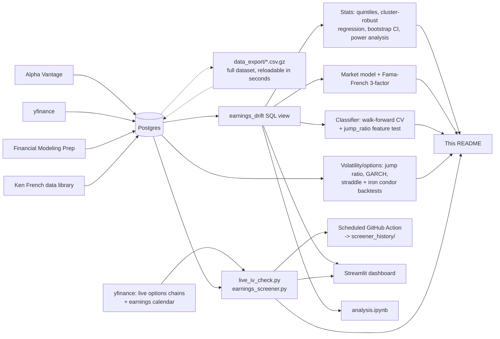

# Post-Earnings Announcement Drift (PEAD) Analysis

**TL;DR:**
- Does beating or missing earnings predict how a stock drifts afterward? Tested on 6,044 real
  earnings events across 125 stocks, 20 years of history, well over a dozen independent
  statistical methods. **Answer: no**, and the null result got stronger, not weaker, as the
  sample grew (807 -> 2,953 -> 6,044 events).
- The more useful finding was about volatility, not direction: earnings days move several
  times a normal trading day for that stock, consistently enough that a naive
  historical-volatility-priced options strategy loses money selling into it.
- A live tool (`live_iv_check.py`) closes the "no real options data" gap with real yfinance
  options chains, and actually got used for a real trade - which surfaced two genuine bugs
  no amount of unit testing had caught, then a third when the ticker universe doubled.
- Full engineering stack: normalized Postgres schema, two APIs feeding it, a reproducible
  data export so anyone can clone and run this in seconds, CI running 20+ scripts against
  real data on every push, a `pytest` suite, and a Streamlit dashboard.
- See [`WALKTHROUGH.md`](WALKTHROUGH.md) for a plain-English tour of every script,
  [`FINDINGS.md`](FINDINGS.md) for a 1-page results summary, or keep reading for the full
  methodology and every number behind it.

I love trading stocks and options, and I pay attention to how price moves around earnings.
That's why I wanted to go in depth on post-earnings announcement drift (PEAD): the idea that
after a company beats or misses earnings, its stock keeps drifting in that direction for days
or weeks instead of re-pricing instantly. It's a real, documented effect in finance research,
and the research also says it should be strongest in small, under-covered stocks and weakest
in mega-caps everyone already watches. I wanted to actually test that myself on real data
instead of just taking it on faith.

**Quick summary:** tested on 6,044 earnings events across 125 stocks, using well over a dozen
independent statistical methods, from simple bucketing up to a full Fama-French 3-factor model,
a compounded equity-curve backtest, and a historical-vol-priced options backtest. No significant
PEAD effect anywhere, and the null result held up (got stronger, actually) as the sample grew
from 807 to 2,953 to 6,044 events, first when the original 20-year backtest matured and again
after widening the universe from 60 to 125 tickers. Separately, the part of this closest to how
I actually trade, earnings-day volatility, is real and large: earnings days move several times a
normal day, consistently enough that a naive historical-vol-priced options strategy loses money
on it. Along the way I
caught several real bugs and a couple of my own wrong assumptions: my own test suite quietly
deleting real production data, an unwinsorized regression producing a false positive that a
placebo check exposed, a Postgres NaN-sorting bug that corrupted raw SQL queries, a naive
backtest that mathematically wiped out a portfolio because of unrealistic position sizing,
and a bootstrap CI that didn't behave the way I expected clustering to behave.

See [`analysis.ipynb`](analysis.ipynb) for a narrative version with charts rendered inline.

## The question

1. Does PEAD show up, and is it predictable, in real market data?
2. Does the effect get stronger as analyst coverage drops, the way the literature says it
   should? Tested against my own three-tier sample, not just cited.

## Data & methodology

Earnings surprises come from Alpha Vantage for 12 of 20 large-cap tickers, and yfinance for
everything else (the other 8 large-caps plus all mid/small-cap). I validated yfinance against
Alpha Vantage on overlapping data first, surprise percentages matched within about 0.2 points,
before trusting it as the primary source, after Alpha Vantage's free key stayed rate-limited
for over 24 hours across two calendar days, well past its advertised reset.

Daily prices come from Financial Modeling Prep for large-caps and yfinance for mid/small-caps
(FMP's free tier only whitelists a small set of large-cap symbols). SPY is the benchmark used
to compute abnormal drift: a stock's raw move minus the S&P 500's move over the same window,
which isolates the earnings-specific reaction from whatever the broad market was doing. For
the market model and Fama-French sections below, daily market, size, and value factor returns
come from Ken French's public data library, the same source used in real academic finance
research.

The universe is 125 stocks across three market-cap tiers, roughly 41 large / 42 mid / 42 small,
spread across Tech, Financials, Healthcare, Consumer, Defense, and Industrials. It started at
60 tickers (20/20/20); `ingest_expansion.py` roughly doubled it later, adding real, validated
names in the same tier/sector design rather than picking easy ones after the fact. Price
history goes back to 2006 (or IPO date) rather than a short recent window, since Alpha
Vantage's earnings history already went back to 1996 for large-caps, so extending price
coverage unlocked hundreds of already-available historical events for free.

"Day 0" is the reported earnings date if released pre-market, otherwise the next trading day.
Large-cap uses Alpha Vantage's explicit report-time field for this; mid/small-cap defaults to
post-market since that field isn't reliably available from yfinance, a disclosed
simplification that's reasonable since most companies report after close anyway.

Signals tested: surprise size, 5-day pre-earnings momentum, Day-0 volume vs. the trailing
20-day average, and volatility change. Drift windows: 5, 10, and 20 trading days after Day 0.
Everything is pulled into a normalized Postgres schema (Docker) and joined through a SQL view
built on layered window functions (`LEAD`/`LAG`, rolling `AVG`/`STDDEV_SAMP`) to compute
forward/trailing returns, volume, and volatility per ticker.



## Results

6,044 earnings events across all 125 tickers, up to 20 years of history where available.

### Quintile buckets

| Surprise bucket | Median surprise | Avg. abnormal drift (10d) | p-value |
|---|---|---|---|
| Big miss | -9.56% | +0.26% | 0.162 |
| Miss | +1.44% | +0.30% | 0.053 |
| Meet | +5.59% | +0.10% | 0.494 |
| Beat | +12.92% | +0.00% | 0.985 |
| Big beat | +38.93% | +0.49% | 0.026 |


*Bar height is average abnormal drift (10 trading days) for each surprise-size bucket, big
miss to big beat. A real PEAD effect would climb left to right; these bars don't.*

If PEAD were real here, this should read like a staircase. It doesn't - and while the "big
beat" bucket's raw p-value now crosses 0.05 on its own, it doesn't survive multiple-comparison
correction (corrected p=0.210, see below), the same pattern this project has caught before with
individual tests that look marginal in isolation.

### Coverage hypothesis (Spearman correlation, by tier)

| Tier | Window | n events | n tickers | Spearman r | p-value |
|---|---|---|---|---|---|
| Large-cap | 10d | 2,257 | 41 | -0.004 | 0.840 |
| Large-cap | 20d | 2,257 | 41 | 0.019 | 0.363 |
| Mid-cap | 10d | 1,910 | 42 | -0.016 | 0.476 |
| Mid-cap | 20d | 1,910 | 42 | 0.015 | 0.507 |
| Small-cap | 10d | 1,877 | 42 | 0.010 | 0.665 |
| Small-cap | 20d | 1,877 | 42 | 0.020 | 0.396 |

### Cluster-robust regression (and a bug I caught mid-analysis)

Repeated events from the same company aren't fully independent, so standard errors should be
clustered by ticker rather than treated as one pile of i.i.d. observations. My first attempt
produced a suspiciously "significant" large-cap result that contradicted the Spearman test on
identical data. Turned out to be two compounding problems: a handful of extreme outlier
surprise values (up to +6,567%, from near-zero EPS estimates) dominating an unwinsorized
linear fit, and unreliable inference because large-cap only had 12 ticker-clusters at the time
(the rule of thumb wants 30-50+). Fixed by winsorizing at the 1st/99th percentile and flagging
any tier with too few clusters to trust.

| Tier | Window | n | clusters | Coef | Cluster-robust p | Corrected p |
|---|---|---|---|---|---|---|
| Large-cap | 10d | 2,257 | 41 | 0.0014 | 0.822 | 0.822 |
| Large-cap | 20d | 2,257 | 41 | 0.0119 | 0.033 | 0.100 |
| Mid-cap | 10d | 1,910 | 42 | 0.0067 | 0.075 | 0.151 |
| Mid-cap | 20d | 1,910 | 42 | 0.0129 | 0.019 | 0.100 |
| Small-cap | 10d | 1,877 | 42 | 0.0031 | 0.409 | 0.490 |
| Small-cap | 20d | 1,877 | 42 | 0.0072 | 0.111 | 0.167 |

Every tier now has 41-42 clusters (large-cap started at just 12 since it originally began as
Alpha Vantage-only; sourcing the rest via yfinance, then widening the universe further, pushed
every tier well past the 30-50 rule of thumb). Two numbers land close to the raw 0.05 line,
large-cap and mid-cap at 20 days, but neither survives Benjamini-Hochberg correction (both
land at a corrected p of 0.100).

### Classifier: random split vs. walk-forward

A random 80/20 split scored 51.1% (logistic regression) and 52.6% (random forest) against a
50.4% baseline, already basically a coin flip. A random split on time-series data also risks
lookahead bias: a model partly trained on later events predicting an earlier one, same
principle as avoiding lookahead bias in a trading backtest. 5-fold walk-forward validation
(only training on chronologically earlier events) confirms it: 50.5% and 50.3% average
accuracy against a 52.1% baseline. Both sit at or below baseline in nearly every fold.

**Does adding the jump_ratio feature help?** The volatility work later in this project
engineered `jump_ratio` (the size of the Day-0 move relative to a normal day), which turned
out to be one of the single strongest, most statistically significant numbers anywhere in
this project (p=3.8x10⁻²⁵ in `volatility_risk_premium.py`). `model_v2.py` checks the obvious
follow-up: does feeding that into the same walk-forward classifier actually help predict
drift direction? Logistic regression moves by +0.10 percentage points, random forest by
+0.16, both well under a point, and still below their own baseline. That's not a contradiction:
`jump_ratio` measures the *size* of the reaction, not which way it goes, and there's no real
reason a magnitude feature should help predict direction. A feature can be one of the
strongest, most real findings in the whole project by one measure (realized volatility) and
still add essentially nothing by a completely different measure (directional accuracy).

### Pipeline validity check

Raw drift tested against SPY's return should come back strongly significant, since most
stocks move with the broad market. It does: r=0.459, p=3.62×10⁻³¹³. Good, the null result
elsewhere isn't because the pipeline is broken.

### Event study and placebo check

Average daily abnormal return, 10 days before to 20 after Day 0, cumulated. Abnormal return
spikes right on Day 0 (+0.27% mean, versus roughly -0.02% to +0.16% on every other day in
the window), and day-to-day volatility more than triples (std 6.21% at Day 0 versus 1.7-2.0%
everywhere else), then the curve goes flat. The market reprices instantly here, it doesn't
drift.


*X-axis is trading days relative to the earnings reaction (Day 0); y-axis is the cumulative
abnormal return. The line jumps at Day 0 and stays flat afterward, instant repricing, not
gradual drift.*

A raw test of "any positive drift after Day 0" (ignoring surprise direction) does come back
significant on its own: mean +0.55%, p<0.0001. So I ran a placebo check, the identical test on
random non-earnings days, 100 times with different draws rather than trusting one lucky
comparison. The real result sits in the lower half of that distribution: placebo mean +0.73%
(range +0.52% to +1.03%) vs. the real +0.55%. Empirical p-value: 0.960. That "significant"
drift isn't earnings-specific. It's this sample's general upward tendency over the period, and
random days without any news show it just as much. Without this check I'd have reported +0.55%
as evidence for PEAD, and I'd have been wrong.


*Histogram of mean post-Day-0 CAR across 100 random-day placebo runs; the vertical line marks
the real earnings-day result. It sits inside the distribution, not off to one side of it.*

### Market model: proper beta-adjusted abnormal returns

Everywhere above, "abnormal drift" assumes every stock moves 1-for-1 with the market. The
actual academic standard (Brown & Warner 1985) estimates each stock's real beta from a clean
250-day window before the event, with a 30-day gap so the event can't leak into the estimate.
Average beta here is 1.04 (median 1.02), meaning these stocks move roughly in line with the
market on average now that the universe is broader, so the simpler method was crediting
whatever extra beta-driven sensitivity existed to "abnormal" earnings movement. Beta-adjusted,
the post-Day-0 drift stays small and insignificant: mean CAR change Day 0 to Day +20 is
+0.091% (p=0.389). A cleaner confirmation of what the placebo check already found.

### Fama-French 3-factor model

The market model only controls for beta. The actual next step in the academic literature
(Fama & French 1993) also controls for size (SMB) and value (HML), using free daily factor
data pulled directly from Ken French's public data library, the same source real asset
pricing research uses. Same pre-event estimation window and 30-day gap as the market model,
just three factors instead of one. Result: CAR is +0.337% at Day 0, and actually declines to
+0.271% by Day +20 rather than climbing. The formal continuation test is not significant
(mean -0.066%, p=0.504). The most sophisticated model tested here agrees with everything else.

### Multiple comparison correction

Applied separately to the 8 quintile/tier tests and the 6 cluster-robust regressions. Nothing
survives in either family. The same pattern (one test looks marginal alone, none survive
correction) reproduced across every sample size as the dataset grew from 807 to 2,953 to
6,044 events.

### Sector cut, and other signals

Same test sliced by sector instead of market-cap tier: no sector result is even marginal on
its own anymore (smallest raw p is Financials at 0.190, all six corrected to 0.870). Volume
spike and volatility change, the other two features this pipeline computes, don't predict
drift either, in any tier (all corrected p-values above 0.33).

### Was this test even powerful enough to find something?

A null result only means something if the test could have detected a real effect had one
existed. Using a standard Fisher z-transform power calculation, the tier-level tests (n=1,877
to 2,257, up from n=835-1,237 before widening the universe) could reliably detect a Spearman
correlation as small as 0.059-0.065 at 80% power, comfortably under 0.1, Cohen's conventional
threshold for a "small" effect. Every observed correlation is well below even that tighter
bar. The two thinnest sector splits, Defense (12 tickers) and Industrials (16), sit right at
the edge (detection thresholds of 0.116 and 0.102, just over the "small effect" line) rather
than clearly underpowered the way they were at 4-6 tickers each before the universe widened,
and their observed correlations are still smaller than even their own detection threshold.
This wasn't an underpowered test missing something real; it just didn't find anything.

### Does it even make economic sense to trade?

Statistical significance and economic significance are different questions. The most obvious
naive PEAD trade, long the "big beat" quintile and short "big miss," nets a gross spread of
+0.23% before any trading costs at all, and about -0.17% after a conservative 20bps round-trip
cost assumption per leg. Not tradeable by any standard, on top of never being statistically
significant to begin with.

### A real equity curve, not a pooled average

The naive strategy above is a single pooled number across all 2,412 qualifying trades, which
hides what actually matters if you traded this through time: does it blow up, and by how much,
along the way? `backtest_equity_curve.py` sequences every trade by its actual Day-0 date and
builds a proper compounded equity curve instead of a spreadsheet-style average.

First pass at this used a plain cumulative sum of percentage returns, which produced a max
drawdown of -494%. That number is impossible for real capital (you can't lose more than
everything without leverage), which was the tell that a raw cumsum is the wrong way to
compound sequential returns. Switching to `(1 + return) .cumprod()` fixed the math, but then
surfaced a second, more interesting problem: modeled as one trade betting the full account
in sequence, the corrected equity curve still hit exactly -100%, a total wipeout. That's not
a finding about PEAD, it's what happens to any strategy, good or bad, if you bet the whole
account on one position with no diversification. Sizing each trade at 10% of capital (a
reasonable stand-in for a book holding several positions at once) removes that artifact and
gives a number that actually means something:

| Metric | Value |
|---|---|
| Trades | 2,412 (1,203 long, 1,209 short) |
| Span | 19.8 years, ~122 trades/year |
| Mean return per trade (net of cost) | -0.29% |
| Annualized Sharpe ratio | -0.44 |
| Max drawdown | -58.1% |
| Win rate | 46.5% |
| Total compounded return | -52.7% |


*Wealth index over time (starting value = 1.0) for the naive long-beat/short-miss strategy,
compounded trade by trade at 10% position sizing. Trends down, not up.*

A tradeable long-short strategy generally wants a Sharpe ratio comfortably above 1.0. This
one's negative, which lines up with everything else in this project: no statistical edge,
no economic edge, and now no risk-adjusted edge either.

### Volatility around earnings: the part that actually matters for selling options

Everything so far asks whether the *direction* of a surprise predicts what happens next. That's
the PEAD question. It's not, though, the question I actually care about when I'm selling calls
or puts around an earnings date, which is really about how much the stock moves on the day
itself, not which way. `volatility_risk_premium.py` measures that directly: for every event,
it compares the size of the Day-0 move to that stock's own trailing 20-day normal daily move.

This project has no options-chain data, so it can't measure implied volatility directly.
What it can measure, from price data already sitting in the database, is the realized side:
the earnings-day move was on average 2.28x a normal day for that same stock (1.19x at the
geometric mean, which is the fairer summary given how right-skewed the ratio is), and beat a
normal day outright 59.7% of the time. A one-sided test on the log ratio confirms this isn't
noise (t=10.34, p=3.78x10⁻²⁵). Broken out by tier, the jump is largest in mid/small-caps
(2.47x mean each) and smallest in large-caps (1.95x), the same coverage pattern that shows up
everywhere else in this project, just measured through a completely different lens.

| Tier | n events | Mean jump ratio | Median jump ratio |
|---|---|---|---|
| Large-cap | 2,269 | 1.95x | 1.15x |
| Mid-cap | 1,911 | 2.47x | 1.51x |
| Small-cap | 1,889 | 2.47x | 1.43x |


*Left: distribution of the jump ratio (earnings-day move / normal-day move) across all
events; the dashed line marks 1.0x, a normal day. Right: the same ratio split by tier.*

Sector is a dimension the tier cut can't see, since every tier mixes all six sectors
together. Cutting the same jump ratio by sector instead turns up something tier alone
hides:

| Sector | n events | Mean jump ratio |
|---|---|---|
| Tech | 1,528 | 3.35x |
| Healthcare | 950 | 2.38x |
| Consumer | 1,128 | 2.18x |
| Defense | 584 | 1.68x |
| Industrials | 747 | 1.65x |
| Financials | 1,132 | 1.55x |

Tech runs the hottest by a wide margin, more than double most other sectors. Widening the
universe changed the bottom of this ranking: Defense used to be the one sector where the
Day-0 move barely beat a normal trading day (0.96x, on the original 4 Defense names), and
Financials is now the calmest sector instead (1.55x), with Defense actually the third-hottest
after the new Defense tickers (RTX, NOC, GD, and others) came in with more typical reactions
than the original small sample. Worth naming honestly: a 4-6 ticker sector can flip its
ranking entirely once the sample gets more representative, which is itself a real argument
for why the tier/sector splits with the fewest names deserve the least confidence.

This is exactly why options carry elevated implied volatility going into an earnings date,
the market is pricing in that a normal day's volatility badly understates what's coming. It
doesn't tell me whether that elevated IV is priced *too* high on average, that's a separate
question about actual option prices this project can't answer without options data. But the
PEAD result above is still relevant context for anyone selling premium here: since the drift
after Day 0 is statistically indistinguishable from zero, the earnings-day move behaves like a
one-time jump rather than the start of a multi-day trend, which is the cleaner setup for a
defined-risk premium-selling trade than one where direction tends to keep going afterward.

### Would selling a historical-vol-priced straddle actually have worked?

The jump ratio above says the earnings-day move is real and large. `straddle_backtest.py`
takes the obvious next step: price an at-the-money straddle using only trailing historical
volatility, no options-chain data, using the Brenner & Subrahmanyam (1988) approximation
(straddle price is about 0.8 x price x daily volatility for a one-day option), sell it into
every one of these 6,069 events, and see what happens.

It loses money, clearly and consistently: mean P&L of -2.49% of the stock's price per trade
(p<0.0001), a win rate of only 33.5%, and losses in every tier (large -1.79%, mid -2.86%,
small -2.96%). Implied vol would need to run at roughly 2.5x the trailing historical level
just for this to break even on average.


*Left: distribution of per-event P&L (% of stock price) from selling a historical-vol-priced
straddle into every event; mass sits well left of zero. Right: mean P&L by tier.*

By sector, a similar but not identical pattern from the jump ratio shows up on the P&L side:

| Sector | n events | Mean P&L | Win rate |
|---|---|---|---|
| Tech | 1,528 | -4.47% | 20.7% |
| Consumer | 1,128 | -2.54% | 34.8% |
| Healthcare | 950 | -2.52% | 34.7% |
| Defense | 584 | -1.51% | 41.1% |
| Industrials | 747 | -1.16% | 41.1% |
| Financials | 1,132 | -1.14% | 39.7% |

Tech is the worst sector to sell this trade into by a wide margin, the same sector with the
biggest jump ratio above. Financials now comes closest to breakeven on P&L (-1.14%), while
Defense and Industrials tie for the best win rate (41.1%) - a reordering from the original
60-ticker run, where Defense alone looked like the closest thing to a coin flip. Same
underlying reshuffle as the jump-ratio table above: a thin sector sample moved once real
tickers were added, not a sign the original numbers were wrong, just less stable with only a
handful of names behind them.

That's not a real counterexample to selling options for a living, and I want to be clear
about why. This price is deliberately the cheapest reasonable price for the straddle, since
it ignores everything the market actually knows going into an earnings date: real implied
volatility runs well above historical volatility precisely because the market is pricing in
the jump this project measured directly above. A 2.5x multiplier is actually within the range
real earnings implied-vol run-ups reach in practice. What this shows honestly is a lower
bound: if you can't get implied vol priced at least a few multiples over historical, you're
picking up a genuinely bad number, and this project has no options-chain data to say whether
real-world IV clears that bar by enough to be a profitable trade net of realistic spreads.

### Iron condor: does capping the loss actually change the picture?

The straddle backtest above modeled a naked short straddle, undefined risk. That's not
really how most people who trade earnings with options size a position: undefined risk
needs far more margin, and one bad print can wipe out weeks of gains. `iron_condor_backtest.py`
reruns the same backtest with the loss capped by protective wings (an iron condor), set at 3x
the credit received, a representative defined-risk setup rather than a fitted parameter. It
keeps the same credit collected as the straddle version and only caps the downside, which
overstates the condor's real edge somewhat, since real wings cost part of the credit to buy.

| | Mean P&L | Worst single event |
|---|---|---|
| Naked straddle (uncapped) | -2.49% | -50.1% |
| Iron condor (3x credit cap) | -1.45% | -17.6% |

Capping the loss doesn't just trim the tail, it noticeably improves the average too, because
the naked version's left tail is fat enough that a handful of catastrophic single events were
dragging the average down harder than the typical trade. The cap actually bound on 23.0% of
events, and the pattern holds across a range of wing widths (2x to 6x credit, see the script
output for the full sensitivity table).


*Overlapping P&L distributions for the uncapped (naked) and capped (iron condor) versions of
the same trade. Capping trims the fat left tail without shifting the average sign.*

The average outcome is still negative either way on this historical-vol-priced basis, so this
isn't a case for trading earnings condors as a reliable edge. It is a concrete illustration of
why real options traders size earnings positions with defined risk in the first place: not
because it improves the expected outcome in general, but because it prevents any single bad
print from being the one that actually matters.

### GARCH(1,1): does a real volatility-forecasting model change the story?

Every volatility number so far uses a 20-day rolling standard deviation as "normal"
volatility. That's a reasonable, common baseline, but real volatility forecasting almost
always uses something that captures volatility clustering, the tendency for calm and choppy
periods to persist, instead of weighting the last 20 days equally.
`garch_volatility_forecast.py` fits a GARCH(1,1) model (Bollerslev 1986, the standard
textbook volatility-forecasting model) per ticker and checks whether a genuinely more
sophisticated model changes the jump-ratio and straddle-pricing conclusions.

One honest caveat up front: the market model and Fama-French sections in this project fit
only on a clean pre-event window specifically to avoid lookahead bias. Refitting a fresh
GARCH model before each of ~6,000 individual events would be its own project. This fits one
GARCH model per ticker on its full available history instead (125 tickers, each fit in well
under a second), so the fitted parameters carry mild lookahead bias, even though each daily
forecast itself only uses information through the prior day. Good enough to ask "does a
smarter model change the conclusion," not a substitute for the point-in-time discipline used
in the market-model and Fama-French sections.

The two volatility estimates agree in shape (Spearman r=0.896) but aren't the same number.
GARCH comes out measurably closer to the actual realized move: geometric mean jump ratio
drops from 1.19x (rolling window) to 1.00x (GARCH), and the breakeven implied-vol multiplier
for the straddle backtest drops from 2.54x to 2.18x. The rolling-window ratio is still
statistically real (t=10.34, p=3.8x10⁻²⁵), but at this wider sample, the GARCH-based ratio is
no longer distinguishable from 1.0 (t=0.17, p=0.43) - a genuinely different result from the
original 60-ticker check, not just a smaller version of the same one.


*Left: rolling-window vs. GARCH(1,1) daily volatility estimates, one dot per event, dashed
line is y=x. Right: geometric-mean jump ratio under each method.*

That doesn't mean GARCH-priced straddles stop losing money, though, and the reconciliation is
worth spelling out rather than glossing over: Brenner-Subrahmanyam prices the straddle at
*0.8x* daily volatility, not 1.0x. Even a jump ratio that averages almost exactly 1.0 (a
"normal" day, by the GARCH model's own reckoning) still means the realized move typically
exceeds the 0.8x-scaled premium collected, so the trade keeps losing on average even though
the narrower "is the jump ratio above 1" claim no longer holds up on its own at this sample
size. A genuinely better volatility model gets closer to realistic, but doesn't close the
gap, and this is exactly why: neither model has any way to know an earnings date is coming,
since both are purely backward-looking time-series models. That remaining gap is exactly the
volatility risk premium options markets price in ahead of an earnings date, information a
time-series model structurally can't have no matter how sophisticated it gets.

`garch_volatility_forecast.py` only reported that gap as a single summary statistic, though
(the breakeven multiplier), never rebuilt the actual straddle and iron condor backtests with
GARCH pricing end to end. `garch_straddle_backtest.py` closes that: same 6,069 events, same
Brenner-Subrahmanyam formula, same 3x-credit iron condor cap, priced off GARCH volatility
instead of the rolling window, so the comparison is apples to apples rather than two
different scripts on two different samples.

| | Rolling 20-day | GARCH(1,1) |
|---|---|---|
| Mean P&L, naked straddle | -2.49% | -2.22% |
| Win rate | 33.5% | 37.9% |
| Breakeven IV multiplier | 2.53x | 2.17x |
| Mean P&L, 3x-credit iron condor | -1.45% | -1.44% |
| Worst single event, iron condor | -17.6% | -18.9% |

Per-event P&L from the two pricing methods correlates at 0.98, and the tier pattern holds in
both (small/mid-cap worst, large-cap least bad). GARCH pricing is measurably less bad across
every metric, and both are still overwhelmingly significant on the P&L test itself (GARCH:
p=1.2x10⁻²⁷⁰), exactly consistent with the single-ticker check finding it a better volatility
estimate, not a coincidence specific to whichever tickers that earlier check happened to use.
It still doesn't flip the conclusion: selling this trade priced off either method loses money
on average, historically, whether capped or naked.


*Overlapping P&L distributions for the same events, priced with rolling-window volatility
versus GARCH(1,1). GARCH shifts the distribution right (less bad) without changing its sign.*

### Does the earnings-day volatility spike actually linger afterward?

One more natural question out of the volatility work above: does the Day-0 spike bleed into
the following two weeks, the way volatility clustering usually works in markets, or does it
snap back to normal almost immediately? The `earnings_drift` view already computes a
`volatility_change_ratio` column for exactly this (10-day realized volatility after Day 0,
over the 20-day realized volatility before it), it just hadn't been the headline of any
script until `volatility_crush_check.py`.

The geometric mean ratio is 0.93, and the median is 0.93, both below 1, and a one-sided test
on the log ratio confirms it (t=-12.75, p=4.8x10⁻³⁷). If anything, realized volatility in the
ten days after an earnings event is slightly *below* the stock's own normal level, not
elevated (the arithmetic mean, 1.03, sits just above 1, but that's the right skew a handful of
large spikes creates, exactly why the geometric mean is the fairer summary here too). It
doesn't depend on the size of the surprise either (Spearman r=0.016 against `|surprise %|`,
p=0.205, not distinguishable from zero); the reversion looks like a fairly universal pattern
rather than something proportional to how big the news was.


*Left: distribution of the volatility-change ratio (10 days after Day 0 / 20 days before);
the dashed line at 1.0 marks no change. Right: the same ratio split by tier.*

Combined with the event study (drift is flat after Day 0) and the volatility jump analysis
(the reaction concentrates almost entirely on Day 0 itself), this is the same "one-time jump,
not a regime change" story showing up a third way, whether measured as price drift or as
volatility. For anyone holding a short-vol position around earnings, the practical read is
that the risk here is concentrated overwhelmingly in the event day itself, not in the days
that follow it.

### Bootstrap confidence intervals: does clustering matter here too?

The cluster-robust regression earlier in this project showed that treating repeated events
from the same company as independent observations understates uncertainty. `bootstrap_confidence_intervals.py`
checks whether the same logic applies to a completely different tool: a bootstrap confidence
interval around the tier-level Spearman correlations. A naive bootstrap resamples individual
events; a cluster bootstrap resamples whole companies, keeping every quarter from a chosen
ticker together.

Going in, I expected the cluster interval to come out wider everywhere, the same story as the
regression. That's only half true:

| Tier | Observed r | Naive 95% CI width | Cluster 95% CI width | Cluster / naive |
|---|---|---|---|---|
| Large-cap | -0.004 | 0.090 | 0.092 | 1.02x |
| Mid-cap | -0.016 | 0.096 | 0.093 | 0.97x |
| Small-cap | 0.010 | 0.097 | 0.080 | 0.82x |

Large-cap comes out about the same, and mid/small-cap actually come out *narrower* under
cluster resampling. That reproduces with a different random seed and resample count, so it's
a real pattern, not noise. My best explanation: the regression's cluster-robust standard error
corrects for correlated residuals within a company (an unusually predictive quarter tends to
be followed by another one), while this is resampling whole companies for a rank correlation
computed once over the pooled tier, a different object entirely, and the quarter-to-quarter
pattern within a single company here just isn't as internally correlated as those residuals
were. Both intervals still comfortably straddle zero regardless, so the conclusion doesn't
move, but "does clustering widen my interval" turned out to depend on which statistic you're
clustering, not something safe to assume just because it mattered for the regression.

### Does the holding-period lesson from the live tool generalize?

Fixing `live_iv_check.py` for a real trade (see "Two more bugs found by actually using this
for a real trade" below) exposed a blind spot in every backtest above: `straddle_backtest.py`
and `iron_condor_backtest.py` both price and resolve every trade over a single day, but a real
option's holding period (from before the report to actual expiration) isn't always 1 trading
day, and the extra days add real, independent variance, not just noise around the first day's
number. `holding_period_sensitivity.py` applies that same lesson to the full 20-year, 125-ticker
dataset instead of one ticker on one night: reprice both backtests at 1, 2, 3, and 5 trading
days of assumed holding period and see whether the conclusion holds up.

| N (trading days) | Events | Mean P&L, naked | Win rate | Breakeven IV multiple | Mean P&L, condor | Worst event, condor |
|---|---|---|---|---|---|---|
| 1 | 6,068 | -2.64% | 30.9% | 2.77x | -1.55% | -17.6% |
| 2 | 6,065 | -2.52% | 35.4% | 2.20x | -1.70% | -23.3% |
| 3 | 6,061 | -2.41% | 37.4% | 1.93x | -1.75% | -28.5% |
| 5 | 6,055 | -2.16% | 41.5% | 1.65x | -1.70% | -36.8% |

Going in, I expected longer holding periods to make things worse, the way it did for GOOGL
specifically that night. Historically, across the whole dataset, it's the opposite for the
naked position: mean P&L improves (less negative) and the breakeven IV multiple needed drops
as N grows. The explanation ties directly back to the volatility-crush finding above:
Brenner-Subrahmanyam's sqrt(T) scaling assumes the same daily volatility holds for every day in
the holding period, but realized volatility after an event reverts toward normal (geometric
mean ratio 0.93), not staying elevated. Pricing a longer straddle as if every day were as
volatile as the event day itself means systematically over-collecting premium for the calmer
days that follow, which works in the seller's favor here, on average, historically.

The iron condor tells a different, cautionary story: capped mean P&L gets *worse* with a longer
holding period, and the worst single event more than doubles (-17.6% to -36.8%). The wing cap
is set as a multiple of the credit collected, and since that credit grows with sqrt(N) even
though the "fair" price for the later, calmer days is smaller than that, the cap loosens in
absolute terms faster than the real risk does, letting bigger tail losses through uncapped. A
real defined-risk structure would need wing width set by expected volatility per day, not a
flat multiple of a credit that's already overstated for longer holds - the same lesson from the
live bug, showing up again in a different, structural way here.


*Left: mean P&L (naked vs. iron condor) as assumed holding period grows from 1 to 5 trading
days. Right: the iron condor's worst single event over the same range.*

(Simplification, disclosed: this anchors on the raw report date for every ticker, N trading
days later, rather than each ticker's own pre/post-market-adjusted reaction date. For
post-market reporters, which is most of this universe, N=1 lines up with the existing day0-only
scripts; for pre-market reporters it's one day later than day0. Fine for a sensitivity check
across holding periods, not a byte-for-byte reproduction of those scripts' N=1 case.)

### Does any of this depend on the broader market's mood?

Every test above pools 20 years together, calm markets and stressed ones alike. `vix_regime_analysis.py`
pulls in something this project hadn't used before, the VIX index itself (free via yfinance,
decades of history), and conditions the two headline questions - does surprise size predict
drift, and does selling premium into earnings pay off - on the market-wide volatility regime
at the time, using standard textbook VIX bands rather than sample-dependent terciles.

| VIX regime | n events | Spearman r (surprise vs. drift) | p-value |
|---|---|---|---|
| Low (<15, calm) | 2,217 | 0.014 | 0.524 |
| Medium (15-25, normal) | 3,018 | -0.020 | 0.268 |
| High (>25, stressed) | 809 | -0.009 | 0.788 |

The PEAD null holds in every regime individually, not just on average across them (pooled
r=-0.004, p=0.737, the same order of magnitude as each slice above): there's no calm-market or
stressed-market subset where surprise size starts predicting drift.

| VIX regime | Geo-mean jump ratio | Mean straddle P&L | Win rate |
|---|---|---|---|
| Low (<15, calm) | 1.24x | -2.43% | 32.5% |
| Medium (15-25, normal) | 1.21x | -2.63% | 33.9% |
| High (>25, stressed) | 1.00x | -2.14% | 35.1% |


*Left: Spearman correlation (surprise vs. drift) by VIX regime, all near zero. Right: mean
straddle P&L by the same regimes, not worse in the high-VIX bucket.*

Going in, I expected the opposite of what this shows: a short-vol earnings position at its
worst exactly when the broader market is already stressed, a double whammy rather than a
diversifying bet. Instead the jump ratio is smallest and straddle P&L is least bad in the
high-VIX bucket. The reconciliation: both the jump ratio's denominator and the straddle's
Brenner-Subrahmanyam price are keyed off the same trailing 20-day volatility for that specific
stock, and single-stock realized vol is itself elevated in high-VIX regimes, not just the
index. The "normal day" baseline these percentage-based metrics compare against is already
inflated exactly when VIX is high, which mechanically shrinks the relative jump ratio and
richens the credit collected, even though the absolute earnings-day move isn't obviously
smaller in dollar terms. A real property of vol-scaled metrics, not evidence that a stressed
market makes earnings positions safer in absolute terms, a question this project's
percentage-based framework isn't built to answer on its own.

## Interpretation

No significant relationship between surprise size and abnormal drift, in any tier, across
every independent method tried here. The coverage hypothesis didn't hold up either: every
tier stayed indistinguishable from zero, and more than doubling the sample size (twice: once
as the original backtest matured, again after widening the ticker universe) converged
estimates closer to zero, not further. That's the signature of a genuinely absent effect, not
an underpowered test.

The placebo check is the strongest single piece of evidence here. It shows a result that looks
statistically significant on its own can be fully explained by general sample drift that has
nothing to do with earnings, and that testing for that directly, instead of assuming a small
p-value means what it looks like, is what separates a credible result from a false positive.
Part of why that general drift exists at all is survivorship bias (see below): this universe
is companies that are still around and doing well today, not a random sample of everything
that existed back to 2006.

That null result is genuinely the whole answer to the PEAD question this project set out to
test. It's not the whole answer to the personal question that motivated it, though. Reframed
around volatility instead of direction, the same data shows something real and large:
earnings days move several times a normal trading day (confirmed under two different
volatility models, a simple rolling window and GARCH), that jump doesn't linger into the
following two weeks, and a historical-vol-priced options trade sold into it loses money
consistently enough to be statistically undeniable. None of that is a trading strategy on its
own, the backtested analysis above has no options-chain data to say whether real implied
volatility is priced richly enough to sell profitably, but it is a real, quantified,
sector-varying pattern (Tech runs hottest, Financials calmest) that a purely directional
PEAD test would never have surfaced, and it holds up whether the broader market is calm or
stressed. `live_iv_check.py`, below, actually closes that gap with real (if simplified)
options data instead of leaving it as a permanent disclaimer.

## Live check: is the market pricing this correctly right now?

Every volatility section above ends on the same disclosed limitation: there's no
options-chain data, so nothing in the backtest can say whether real implied volatility is
priced richly enough to be worth selling. `live_iv_check.py` closes that gap directly, using
yfinance's free live options chains and earnings calendar, for the tickers I actually trade
(HOOD, NVDA, GOOGL by default, though it takes any symbol as an argument).

For each ticker, it finds the next earnings date, prices the at-the-money straddle on the
nearest expiration, and isolates the earnings-specific piece of that price using variance
additivity: subtract out the variance this stock's own near-term volatility would explain
over the non-earnings trading days between now and expiration, since an option priced weeks
out mostly reflects ordinary day-to-day movement, not the event itself. It then compares that
isolated expected move to this specific ticker's own historical earnings-day pattern
(the same `jump_ratio` computed in `volatility_risk_premium.py`, scaled by its current
volatility) to get a "richness ratio": is the market pricing in more or less movement than
this stock has actually delivered on past earnings days?

That near-term volatility estimate uses a fresh GARCH(1,1) forecast per ticker, falling back
to the 20-day rolling window only if the fit fails or there's too little history, since
`garch_volatility_forecast.py` already showed GARCH tracks realized moves measurably better.
Deliberately scoped to just that one step, though: the historical ratio itself was computed
against rolling-window volatility throughout history, so scaling it by a *different* method's
current-vol estimate would quietly compare apples to oranges. Swapping in GARCH only where it
doesn't create that inconsistency is a small thing, but skipping it would mean not actually
using the project's own best-known method somewhere it clearly applies.

Run on 2026-07-22, the morning of GOOGL's earnings and a week before HOOD's:

| Ticker | Earnings date | Nearest expiration | Historical typical move | Market-implied move | Richness |
|---|---|---|---|---|---|
| GOOGL | 2026-07-22 | 2026-07-24 (2 trading days out) | 7.08% | 5.46% | 0.77x cheaper |
| HOOD | 2026-07-29 | 2026-07-31 (7 trading days out) | 11.08% | 5.69% | 0.51x cheaper |
| NVDA | 2026-08-26 | 2026-08-28 (27 trading days out) | - | - | skipped, too far out |

NVDA is the honest part of this: its earnings are over a month away, and no closer weekly
option exists yet, so netting out a month of assumed-constant daily volatility is far too
shaky an assumption to trust. Rather than show a number, the script detects that case (nearest
expiration more than 10 trading days out) and says so explicitly. That case surfaced a real
bug during development: the naive version of this subtracted out MORE variance than the whole
option price contained, which would make the earnings-specific variance negative and its
square root undefined. Fixed by clipping at zero, and by refusing to report a result at all
once the expiration is far enough out that the whole approach stops being trustworthy, rather
than quietly returning a number that looked plausible but wasn't.

### Two more bugs found by actually using this for a real trade

Everything above held up fine in testing. It took an actual GOOGL earnings trade, the night
before, to find the next two problems, and they were bigger than cosmetic.

**Wrong contract, silently.** GOOGL reports after market close. The nearest expiration on or
after the raw earnings date from yfinance's calendar was, in this case, *the same calendar
day as the earnings date itself* - a contract that settles at that day's close, hours before
the after-hours reaction exists. It doesn't capture the move at all; real volume and open
interest confirmed nobody trades that one for this purpose, they use the next expiration out.
yfinance's calendar has no pre/post-market flag, so there was no live signal telling the tool
it had picked the wrong one. Fixed using data this project already had: `earnings_events`
already records `report_time` for every historical report, and GOOGL has reported post-market
100% of the time on record, so that history is now used to shift the reaction date forward a
trading day before picking an expiration, rather than trusting the raw calendar date.

**Wrong historical comparison, less obviously.** The historical baseline only ever measured a
single day's move (day0), but the live option has however many trading days actually pass
between the report and expiration - 1 day for some tickers, several for others, and it isn't
always the same number for the same ticker in different quarters. For GOOGL specifically,
that gap is now 2 trading days, and the extra day adds real, independent variance, not just
noise around the first day's number (measured directly: the historical spread nearly triples
once that second day is included). Fixed by measuring the **cumulative** historical move over
exactly as many trading days as the live option actually has left, per ticker, per check,
instead of a fixed single day for everyone. Both fixes came from a `shift_to_reaction_date()`
and `historical_cumulative_jump_stats()` addition, tested independently the same way as the
rest of this project's math (see `tests/test_live_iv_check.py`).

The combined effect on this specific case was not small: GOOGL initially showed **1.44x
richer** than its own history. Properly aligned to the right contract and the right
historical comparison, it actually shows **0.74x cheaper**. Same ticker, same night, opposite
conclusion, because the first version was quietly comparing against the wrong thing twice.
That's the strongest single argument in this whole project for why a live tool that gets used
for something real matters more than one that only gets unit tested: the real use is what
found this, not the test suite.

### Scaling it up: a screener across the whole universe

`live_iv_check.py` checks one ticker at a time. `earnings_screener.py` runs the same
comparison across all 125 tracked tickers and ranks the results, so instead of remembering to
check a handful of names by hand, it surfaces whichever upcoming earnings currently look the
most mispriced relative to that stock's own history, across the whole universe at once. It
runs in two passes: a cheap calendar-only check on all 125 tickers to find who reports soon,
then the full options-chain pricing only for that shorter list.

Run the morning of GOOGL's earnings, scanning for earnings in the next 30 days, 67 of 125
tickers qualified, and 14 produced a usable comparison after skipping names with no historical
baseline, no options data, or an unreliable netting assumption:

| Ticker | Richness ratio |
|---|---|
| RTX | 3.98x richer |
| LMT | 3.06x richer |
| BA | 1.90x richer |
| TDOC | 1.67x richer |
| GD | 1.52x richer |
| DECK | 1.42x richer |
| MSFT | 1.40x richer |
| AMZN | 1.10x richer |
| INTC | 0.79x cheaper |
| GOOGL | 0.77x cheaper |
| META | 0.62x cheaper |
| TSLA | 0.61x cheaper |
| HOOD | 0.48x cheaper |
| IBM | 0.15x cheaper |

RTX stands out this time (3.98x, reporting the day after this was run), and IBM is priced the
cheapest relative to its own history by a wide margin (0.15x). Two of the original three
Defense names from before the universe was widened, LMT and BA, are still near the top of the
"richer" side, joined now by RTX and GD, new Defense tickers added in the expansion, showing
up here independently rather than needing to be hand-picked.

Building the screener (originally against the 60-ticker universe) surfaced a second real bug,
more general than the first: even within the 10-trading-day "reliable" horizon, if a stock's
own recent realized volatility happens to be running hot relative to what its near-term
options currently price, the same variance subtraction can still clip to zero. AAPL hit this
live during development (8 trading days out, comfortably inside the horizon, still clipped) -
being close to the event doesn't guarantee the netting assumption holds. Fixed by checking for
this directly (`would_clip_to_zero` in `backtest_math.py`, with its own unit tests including
this exact case) rather than trusting proximity to the event as a sufficient safety check.

Widening the universe to 125 tickers surfaced a third: four of the new, thinner names (FMBH,
LKFN, MMSI, SCHL) crashed with a raw `IndexError` instead of a clean skip message. Their
nearest listed expiration had zero call or put contracts at all, something none of the
original 60 tickers happened to trigger, so indexing into "the closest strike" assumed at
least one contract would always exist. Fixed the same way as the other two edge cases in this
section: extracted the check into its own tested function (`chain_has_no_contracts` in
`backtest_math.py`) instead of trusting that a screener run against a bigger, more varied
universe wouldn't eventually hit a case the original three-ticker default never could.

This is descriptive context from this project's own historical data, not a trading signal or
a recommendation, and neither script is reproducible the way every other result in this
README is: they query live market data and today's earnings calendar, so re-running them
later will give different numbers as prices, dates, and available expirations change. That's
the point. Every other script here answers a fixed historical question; these are meant to
actually be rerun before a real trade, to see whether current pricing looks rich or cheap
relative to that stock's own past earnings reactions, which is the version of this project
I'd actually reach for before selling premium into an earnings date. The same comparison for
a hand-picked list of tickers is also built into the dashboard (button-gated, so it only hits
yfinance when asked, and cached for 15 minutes), for anyone who'd rather click than run a
script.

### Running the screener on a schedule

Now that the full dataset loads in seconds (see below), running the historical baseline
query in CI stopped being the blocker it would have been. `.github/workflows/screener_history.yml`
runs `earnings_screener.py` on a schedule (weekdays, 12:00 UTC, plus manual triggering) against
a freshly loaded database, and commits whatever it finds to `screener_history/YYYY-MM-DD.md`.

The point isn't the automation for its own sake, it's that `live_iv_check.py` and
`earnings_screener.py` are the one part of this project meant to be rerun regularly rather
than read once, and a scheduled job that just does that automatically, keeping every day's
result including the uninteresting "too far out" and "variance clipped" skips, not just the
notable hits, is a more honest record than remembering to run it by hand whenever I think of
it. A failed run (yfinance being unreachable or rate-limiting that day, most likely) just
means a missing day, not bad data, since nothing else in this project depends on this
directory existing or being complete.

## Limitations

- Survivorship bias: this universe was picked as well-known companies today, which by
  construction excludes anything that got delisted or went bankrupt along the way. The median
  ticker here still roughly matched the market over its full history, and the mean is far
  above it (see `survivorship_check.py`), so this sample was never going to be representative
  of "the market" as a whole, and that inflates the general upward drift the placebo check
  measured against
- Mid/small-cap Day-0 timing defaults to "post-market" rather than a confirmed report time
- A handful of originally-targeted small-cap tickers got dropped for lack of historical data
  density, itself a small sign that lower-coverage stocks have thinner historical records
- The market-model and Fama-French estimates both need a clean ~280-day window; 98 of 6,044
  events don't have one and are excluded from just those two analyses, though included
  everywhere else. Ken French's factor data also currently ends in May 2026, about two months
  before this project's price data, so the most recent events lose Fama-French coverage first
- Each family of tests was corrected for multiple comparisons within itself; a maximally strict
  version would correct across all families run over the project's lifetime jointly. Since
  every family already came back null, that wouldn't change the conclusion, but it's worth
  naming as the more rigorous option
- The equity-curve backtest treats every trade as sequential and independently sized at 10% of
  capital; it doesn't model overlapping positions (multiple earnings events open at once), which
  a fully realistic backtest of a real trading book would need to handle
- The volatility jump analysis and the straddle backtest both measure realized moves only.
  There's no options-chain data in this project, so neither can say anything directly about
  whether real implied volatility is priced richly enough to be profitable to sell, only that
  the realized jump is large and statistically real, and that a price set by historical vol
  alone isn't good enough to sell profitably
- The straddle backtest also ignores bid/ask spread, commissions, assignment/pin risk, and the
  choice to close a position before expiration instead of holding to it, all real frictions a
  live options book has to manage
- The bootstrap confidence intervals use 5,000 resamples per tier; more would narrow the Monte
  Carlo noise in the interval edges slightly further, though the qualitative pattern (cluster
  CI similar or narrower, not wider, for this particular statistic) already reproduces cleanly
  across different seeds and resample counts
- The GARCH(1,1) model is fit once per ticker on its full available history rather than
  point-in-time before each event, unlike the market-model and Fama-French sections, which
  carefully avoid this. The fitted parameters carry mild lookahead bias as a result, even
  though the daily forecast itself only conditions on information through the prior day
- The iron condor backtest holds the credit received fixed at the straddle's price and only
  caps the loss. A real iron condor's net credit is lower than an equivalent straddle's, since
  part of what you collect pays for the protective wings, so this overstates the condor's real
  edge somewhat. The 3x wing-width multiplier is a representative choice, not a fitted or
  optimized parameter
- `live_iv_check.py` and `earnings_screener.py`'s earnings-only decomposition assumes this
  stock's daily volatility stays roughly constant right up until the event, when real-world IV
  often creeps up in the days just before earnings. They also pick the strike nearest to spot
  rather than true delta-50 ATM, use bid/ask midpoint pricing that can be stale for illiquid
  strikes, and per-ticker historical samples are small for newer names (HOOD has a bit over a
  decade of quarters). Results are only shown when the nearest expiration is within 10 trading
  days of today AND the variance subtraction doesn't clip to zero, since either case means the
  underlying assumption has broken down for that specific ticker
- The scheduled screener workflow depends on yfinance's undocumented public endpoints staying
  reachable and unthrottled from GitHub's runners; a failed day is expected occasionally and
  isn't treated as anything more than a missing snapshot

## What this demonstrates

**Data engineering**: two earnings APIs and two price APIs feeding a normalized Postgres
schema in Docker, idempotent ingestion with real error handling (a third-party API returned a
rate-limit notice with an HTTP 200 instead of an error code, so my original version silently
treated it as "zero results" instead of failing loudly), data quality checks (including one
that caught a real bug, see below), lineage tracking, a SQL view built on window functions
instead of pulling everything into Python, a standalone SQL showcase (`queries.sql`)
answering real business questions directly with CTEs, ranking functions, and native
aggregates, not just through the pandas layer, and a committed, compressed export of the full
643K-row dataset (`export_full_dataset.py` / `load_full_dataset.py`) so cloning this repo gets
anyone to a fully working database in seconds instead of needing their own API keys and days
of rate-limited re-ingestion, verified by loading it into a disposable Postgres container and
confirming every downstream number matched exactly.

**Statistics**: quintile bucketing, cluster-robust regression with an outlier-driven false
positive diagnosed and fixed along the way, a market-beta validity check, walk-forward
cross-validation instead of a leaky random split, Benjamini-Hochberg correction across three
test families (tier, sector, and cluster-robust), an event-study CAR with a 100-run placebo
control that caught a result that looked real but wasn't, a naive trading strategy priced
against realistic transaction costs to separate statistical from economic significance, a
survivorship-bias check quantifying why the sample drifts upward even on random days, a
formal power analysis showing the null result isn't just an underpowered test, a Fama-French
3-factor model using real factor data pulled from Ken French's public library, the same
technique used in actual academic asset-pricing research, a properly compounded equity-curve
backtest with Sharpe ratio and max drawdown instead of just a pooled average return, a
volatility jump analysis (log-scale one-sample t-test) that reframes the whole dataset around
the question that actually matters for selling options around earnings, an options-pricing
backtest using the Brenner-Subrahmanyam approximation to convert historical volatility into
an at-the-money straddle price, a defined-risk (iron condor) variant of that backtest showing
how capping the loss changes both the average outcome and the tail, a GARCH(1,1)
volatility-forecasting model checked against the simpler rolling-window estimate and then
carried all the way through to a full apples-to-apples repricing of both backtests on the
same 6,069 events rather than left as a single summary statistic, a volatility-persistence
check on whether the Day-0 spike lingers or reverts, bootstrap confidence intervals
comparing naive to cluster-level resampling on the headline correlations, a market-regime cut
using VIX (pulled in as a new conditioning variable, not just another slice of the same
ticker data) to check whether either the null result or the volatility-selling picture depends
on the broader market being calm or stressed, and a feature-engineering follow-up feeding the
volatility work's strongest standalone signal back into the walk-forward classifier to check
whether it actually helps predict direction (it doesn't, honestly reported either way).

**Live data integration**: everything above is a fixed historical backtest. `live_iv_check.py`
pulls real-time options chains and earnings calendars from yfinance, decomposes an option
price quoted weeks out into its earnings-specific component via variance additivity, and
compares that to each ticker's own historical reaction pattern, turning the research into
something I'd actually rerun before a real trade instead of a one-time report.
`earnings_screener.py` scales that same comparison across the full 125-ticker universe in two
passes (a cheap calendar check first, then the expensive options-chain pricing only for
near-term reporters) and ranks the results, closer to a real screening tool than a
single-ticker lookup, and reuses `live_iv_check.py`'s comparison function directly rather than
duplicating it, so the two tools can't drift apart. Both use a live GARCH(1,1) forecast for
the volatility-netting step, since the project's own research already showed that beats a
flat rolling window, applied carefully only where doing so doesn't mix inconsistent methods.
Actually using this tool for a real trade surfaced two further real bugs invisible to testing
alone (the wrong options contract getting silently selected for after-hours reporters, and a
historical baseline measured over the wrong number of days) - both fixed, both covered by
`tests/test_live_iv_check.py`, and honestly, the more interesting evidence for why this kind
of tool needs real use, not just unit tests, to actually get it right.

**Software practices**: a `pytest` suite that independently recomputes expected values from
synthetic fixtures and checks the SQL view against them exactly, a second suite of pure unit
tests (`backtest_math.py`) covering the compounding, loss-capping, and options-pricing math
shared by the backtest scripts, hand-calculated and asserted independently of the
implementation, `ruff` linting and `mypy` type checking wired into CI alongside the test suite
and, now that the full dataset is loadable in seconds, a smoke-test of 20+ analysis scripts
against real data on every push too, not just the SQL view against a synthetic fixture, a
`Makefile` for the common
commands, a Streamlit dashboard covering both the PEAD and the volatility/options tracks, plus
a live section that pulls real options-chain data on demand (button-gated and cached for 15
minutes so it doesn't hammer yfinance on every rerun, verified end to end with
`streamlit.testing.v1.AppTest` rather than just eyeballing it in a browser), a per-ticker
jump-ratio and straddle-win-rate summary in the ticker drill-down section so browsing a
specific stock's history and its volatility profile don't live in two disconnected places,
with a static-snapshot fallback for when there's no live database, a narrative Jupyter
notebook as
a companion to the pipeline scripts, and a shared
`db.py` module (`get_engine()`) that the 25+ analysis scripts now all import instead of each
repeating its own copy of the same connection-string boilerplate, a straightforward DRY
cleanup that got more worth doing as the script count grew past two dozen, and a second
scheduled GitHub Actions workflow that loads the full dataset, runs the earnings screener,
and commits the result back to the repo (with `[skip ci]` so the bot's own commit doesn't
trigger a redundant full test run), a real (if small) example of CI/CD automation beyond
just gating pull requests.

**A bug in the project's own safety net**: the test suite had a fixture that assumed a date
range would always be free of real data. True when I wrote it, false once I extended real
price history further back, so running the tests quietly deleted real production data as a
side effect. Caught by comparing row counts before and after instead of just trusting "tests
passed," then fixed by making the fixture back up and restore whatever's really there.

**A real SQL data-quality bug, found while writing showcase queries**: `queries.sql`
(11 standalone business-question queries: window functions, CTEs, `NTILE()`-based quintile
bucketing, native `CORR()`) surfaced a genuine issue the first time I ran it. Postgres'
NUMERIC type allows a literal NaN value, and sorts it as *larger* than every real number, so
"top 10 biggest earnings beats" returned garbage NaN rows instead of the real ones. Traced it
to 22 yfinance-sourced rows where reported EPS exactly equalled estimated EPS: yfinance's own
surprise-percentage field returns NaN in that specific case even though the answer is just
0.0%. Every Python script's `.dropna()` calls had been silently excluding these 22 events the
entire time, so the bug never affected any headline result, but it would have corrupted any
naive SQL query against the same data. Fixed at the source in `ingest_yfinance.py`
(recomputing the percentage myself when yfinance's own field is NaN, using the same
abs-value-denominator convention their correct rows already follow), added a dedicated
data-quality check for literal NaN values, and reran the full pipeline to confirm every
number in this README already accounted for it correctly.

**A backtest that wiped itself out, and why that wasn't actually a finding**: the first
version of `backtest_equity_curve.py` used a plain running sum of trade returns, which produced
a max drawdown of -494%, mathematically impossible for real capital without leverage. Fixing
that with proper compounding (`cumprod`) surfaced a second issue underneath it: modeled as one
trade betting the full account in sequence, the corrected curve still hit exactly -100%. That's
not evidence the strategy is uniquely terrible, it's what any sequence of trades does to a
single undiversified account, good strategy or bad. Sizing each trade at a fixed 10% of capital
removed the artifact and left a result (Sharpe -0.44, max drawdown -58%) that's actually
readable, and still consistent with the null finding everywhere else in this project.

**A wrong assumption about clustering, caught by actually running the numbers**: going into
`bootstrap_confidence_intervals.py`, I expected the cluster-aware bootstrap interval to come
out wider than the naive one in every tier, since that's exactly what happened with the
cluster-robust regression standard errors earlier in this project. It didn't: large-cap came
out about the same, and mid/small-cap actually came out narrower under cluster resampling.
I checked this wasn't a one-off (reran with a different seed and resample count, same
pattern), then worked out why: a regression's cluster-robust SE corrects for correlated
residuals within a company, while a rank correlation computed once over a pooled tier is a
different kind of object, and apparently doesn't have that same internal correlation to
correct for. Worth including specifically because it would have been easy to just assert
"clustering matters, therefore the cluster CI is wider" without checking, since that's the
pattern from the earlier regression section, and the actual numbers said otherwise.

**A negative variance that shouldn't exist, caught by an implausible result**: the first
version of `live_iv_check.py` tried to isolate an earnings-specific expected move for every
ticker, including NVDA, whose earnings were over a month out with no closer weekly option
listed yet. Subtracting that stock's own recent daily volatility over 27 non-event trading
days turned out to explain MORE variance than the whole straddle price contained, making the
"earnings-specific" variance negative and its square root undefined, silently printed as
0.00% instead of erroring. That's not a real answer, a month of assumed-constant daily
volatility is far too shaky an assumption to trust. Fixed two ways: clip the variance at zero
so the math never breaks, and, more importantly, stop reporting a number at all once the
nearest expiration is more than 10 trading days out, since past that point the method itself
isn't reliable regardless of how the arithmetic is guarded.

**The same bug, one horizon check later**: building `earnings_screener.py` to scan the whole
universe caught a second, more general version of the same problem. AAPL's nearest expiration
was only 8 trading days out, comfortably inside the "reliable" horizon from the fix above, and
it still clipped to 0.00%, because its own recent realized volatility happened to be running
hot enough relative to its near-term option prices that the netting assumption broke down
anyway. Proximity to the event isn't a sufficient guarantee on its own. Fixed by checking for
the clipping condition directly (`would_clip_to_zero` in `backtest_math.py`) instead of only
gating on how many trading days out the expiration sits, with unit tests covering both the
original far-dated case and this closer-in one.

**A third live-tool bug, surfaced by widening the universe itself**: running the screener
against the newly-expanded 125-ticker universe crashed on four thin, illiquid names (FMBH,
LKFN, MMSI, SCHL) with a raw `IndexError` instead of a clean skip. Their nearest listed
expiration turned out to have zero call or put contracts at all, something none of the
original 60 tickers happened to trigger, so `.iloc[0]` on "the closest strike" quietly assumed
at least one contract would always exist. Fixed by extracting the check into its own function
(`chain_has_no_contracts` in `backtest_math.py`, tested the same way as the other two edge
cases in this file) rather than only discovering more of these the hard way. The pattern
across all three live-tool bugs is the same: each one was invisible against a small, familiar
set of tickers and only showed up once the tool was pointed at something wider or more real.

## Running it

```bash
./setup.sh   # starts Postgres, creates the venv, installs deps, applies schema+view
```

There's also a `Makefile` (`make lint`, `make test`, `make pipeline`, `make dashboard`) that
wraps the commands below, if you'd rather use that.

**Fast path, no API keys needed:** getting from an empty database to a fully working one the
"real" way means re-ingesting 20 years of data across 125 tickers through free, often
rate-limited APIs, which took real elapsed time originally (Alpha Vantage's key alone stayed
rate-limited over 24 hours at one point). That's a genuine reproducibility gap: anyone cloning
this repo to check the work couldn't actually run it without spending that same time and their
own API keys. `data_export/` has the full dataset already collected, committed as compressed
CSVs:

```bash
python load_full_dataset.py               # restores daily_prices, earnings_events, ff_factors in seconds
```

Verified this actually works, not just assumed it: spun up a completely separate, disposable
Postgres container (never touching the real database, learned that lesson once already, see
below), applied the schema fresh, ran this loader against it, then reran the full analysis
pipeline and the test suite against that freshly-loaded database. Every number matched the
original exactly. This is also what CI now does on every push (see `.github/workflows/ci.yml`),
so a real code change that broke one of the 20+ analysis scripts against actual data, not just
the synthetic test fixture, would actually get caught.

To refresh with newer data instead, or from a totally empty database, with `FMP_API_KEY` and
`ALPHAVANTAGE_API_KEY` set in `.env`:

```bash
python ingest.py                          # original 20 large-cap tickers
python ingest_yfinance.py                 # original 40 mid/small-cap tickers (no keys needed)
python backfill_earnings_yfinance.py      # fallback earnings source for any AV-rate-limited tickers
python backfill_history.py                # extend price history back to 2006/IPO
python ingest_expansion.py                # +65 tickers widening the universe to 125 (no keys needed)
python data_quality_checks.py             # validate the loaded data
make queries                              # standalone SQL showcase (business questions in pure SQL)
python eda.py                             # quintile + significance analysis
python tier_analysis.py                   # coverage hypothesis test + cluster-robust regression
python model.py                           # classifier
python model_v2.py                        # does adding the jump_ratio feature actually help?
python validity_checks.py                 # pipeline sanity check + multiple comparison correction
python event_study.py                     # cumulative abnormal return event study + placebo check
python export_charts.py                   # regenerate the README's chart images (needs event_study.py first)
python market_model.py                    # beta-adjusted market-model event study
python load_ff_factors.py                 # download and load Fama-French daily factors
python fama_french_model.py               # 3-factor abnormal returns
python sector_analysis.py                 # coverage hypothesis test sliced by sector
python signal_analysis.py                 # volume spike and volatility change as predictors
python economic_significance.py           # naive strategy priced against trading costs
python survivorship_check.py              # quantifies the sample's survivorship bias
python power_analysis.py                  # was the test even powerful enough to find something?
python backtest_equity_curve.py           # compounded equity curve, Sharpe ratio, max drawdown
python volatility_risk_premium.py         # earnings-day move vs. normal-day volatility, by tier
python straddle_backtest.py               # historical-vol-priced straddle P&L using Brenner-Subrahmanyam
python iron_condor_backtest.py            # same trade, capped loss, does defined risk change the picture?
python garch_volatility_forecast.py       # GARCH(1,1) vs. rolling-window volatility, does it change anything?
python garch_straddle_backtest.py         # full straddle/condor backtest repriced with GARCH, same events
python holding_period_sensitivity.py      # does the straddle/condor conclusion hold at N=1,2,3,5 day holds?
python volatility_crush_check.py          # does the Day-0 vol spike linger, or revert fast?
python bootstrap_confidence_intervals.py  # naive vs. cluster bootstrap CIs on the headline correlations
python vix_regime_analysis.py             # does the null result / volatility-selling picture hold by VIX regime?
pytest tests/ -v                          # test suite
streamlit run dashboard.py                # interactive dashboard (live DB)
python export_snapshot.py                 # refresh the static snapshot for deployment
python export_full_dataset.py             # regenerate data_export/*.csv.gz after fresh ingestion
jupyter nbconvert --to notebook --execute --inplace analysis.ipynb  # rebuild the notebook
```

One more, kept separate from the pipeline above on purpose, since it's not a reproducible
historical result, it hits live market data:

```bash
python live_iv_check.py                   # or: make live-check
python live_iv_check.py AAPL MSFT          # pass any ticker(s); defaults to HOOD, NVDA, GOOGL
python earnings_screener.py               # or: make screener; scans all 125 tickers, ranked
python earnings_screener.py 14            # pass a custom horizon in days (default 30)
```

The dashboard also runs with no database at all, falling back to the committed
`snapshot/earnings_drift.csv`, plus `snapshot/volatility_jump.csv` and
`snapshot/straddle_pnl.csv` for the volatility/options section. That means anyone can clone
this repo and run `streamlit run dashboard.py` with zero setup, and it's also what would
power a public hosted deployment, since a hosted instance has no access to the local Postgres
container.
