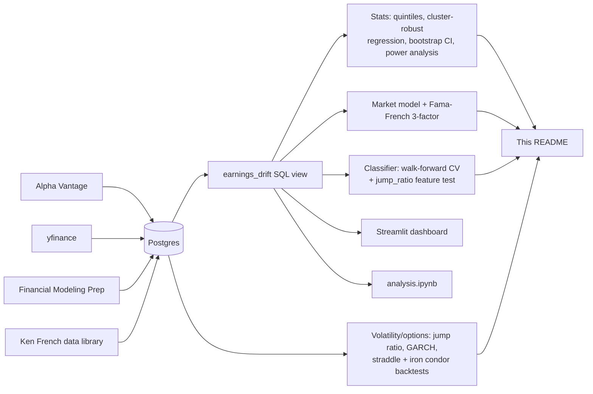
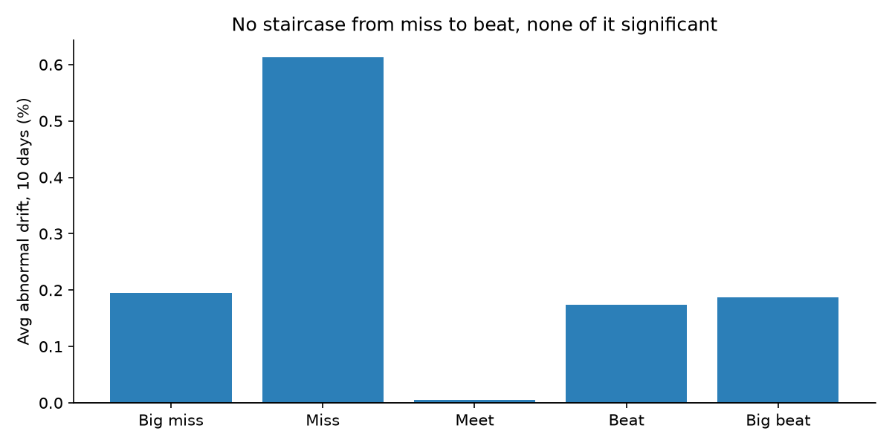
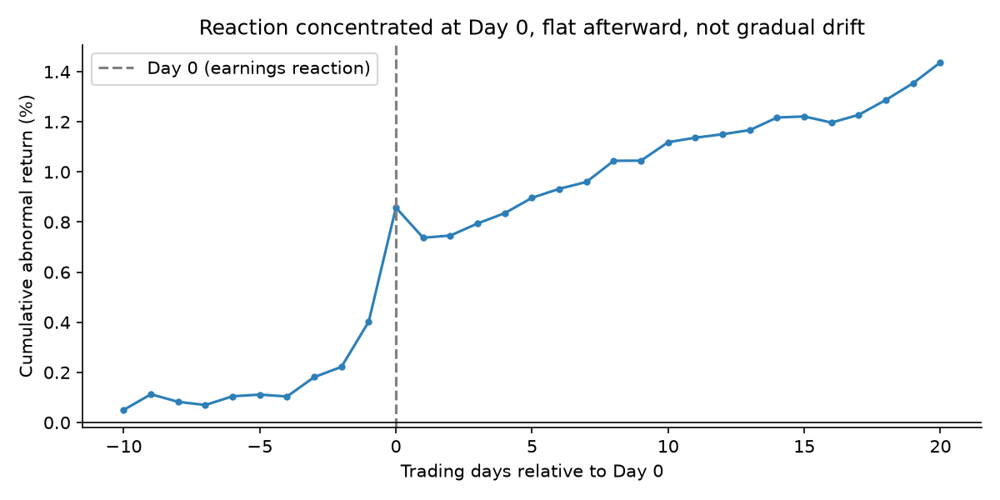
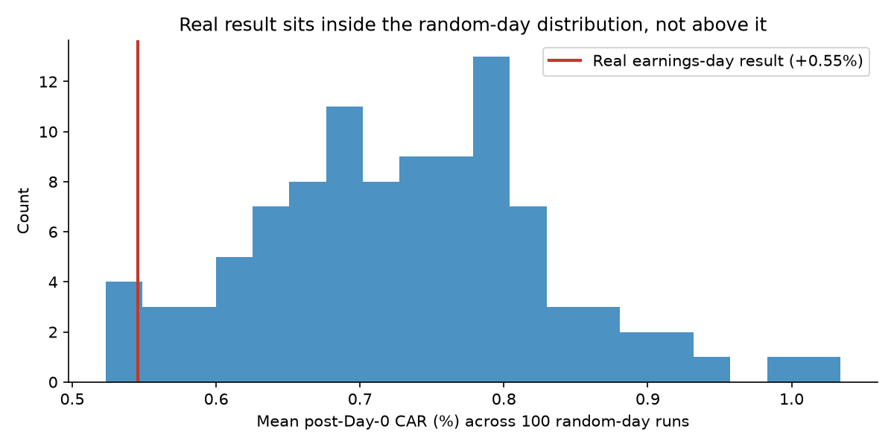
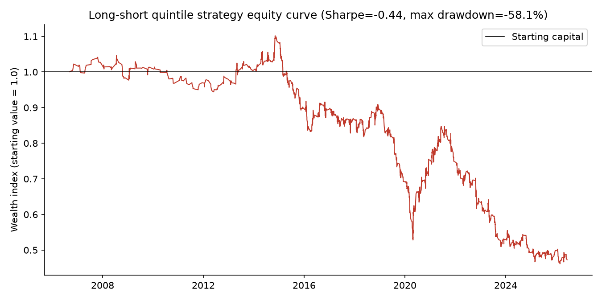
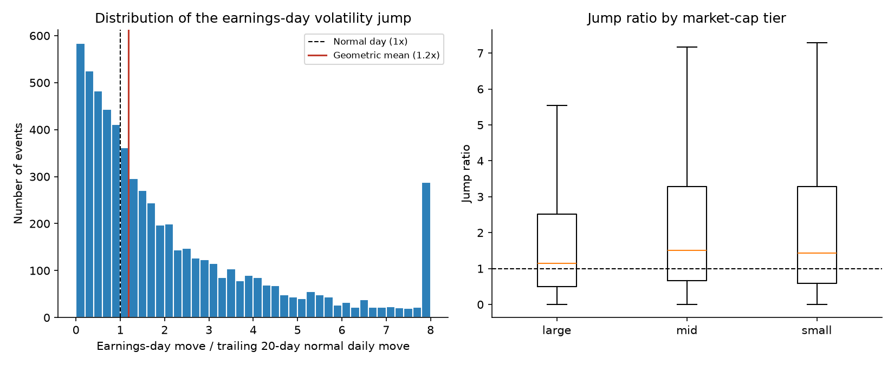
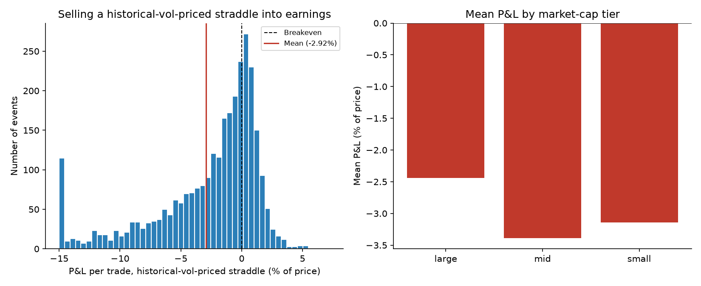
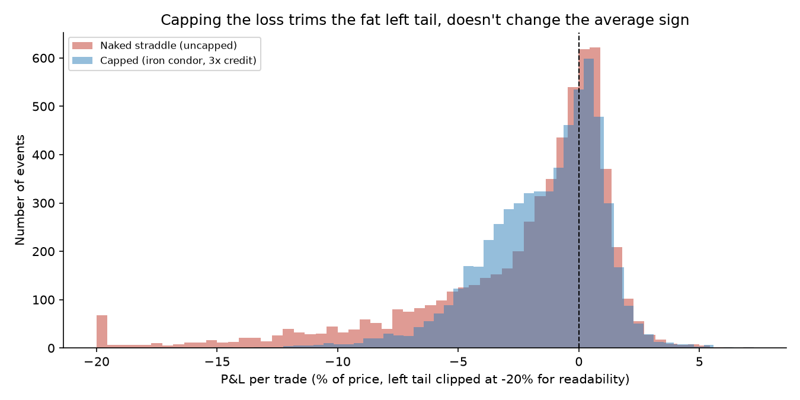
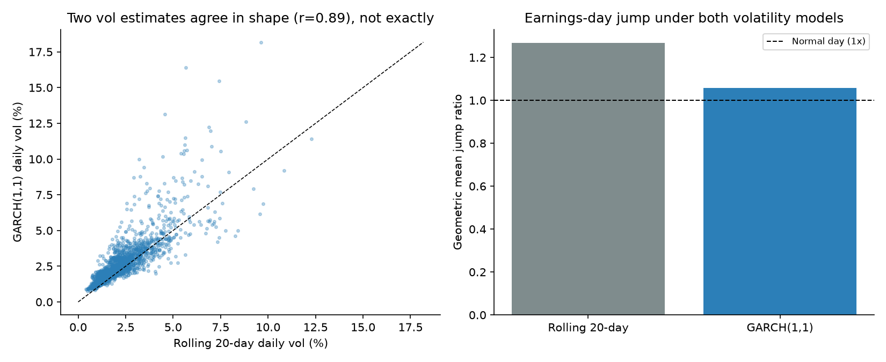
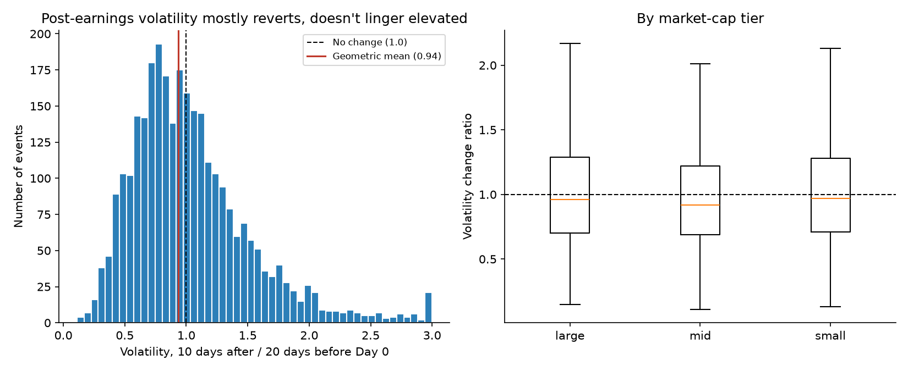

# Post-Earnings Announcement Drift (PEAD) Analysis

I love trading stocks and options, and I pay attention to how price moves around earnings.
That's why I wanted to go in depth on post-earnings announcement drift (PEAD): the idea that
after a company beats or misses earnings, its stock keeps drifting in that direction for days
or weeks instead of re-pricing instantly. It's a real, documented effect in finance research,
and the research also says it should be strongest in small, under-covered stocks and weakest
in mega-caps everyone already watches. I wanted to actually test that myself on real data
instead of just taking it on faith.

**Quick summary:** tested on 2,953 earnings events across 60 stocks, using well over a dozen
independent statistical methods, from simple bucketing up to a full Fama-French 3-factor model,
a compounded equity-curve backtest, and a historical-vol-priced options backtest. No significant
PEAD effect anywhere, and the null result held up (got stronger, actually) as the sample grew
from 807 to 2,953 events. Separately, the part of this closest to how I actually trade, earnings-day
volatility, is real and large: earnings days move several times a normal day, consistently
enough that a naive historical-vol-priced options strategy loses money on it. Along the way I
caught several real bugs and a couple of my own wrong assumptions: my own test suite quietly
deleting real production data, an unwinsorized regression producing a false positive that a
placebo check exposed, a Postgres NaN-sorting bug that corrupted raw SQL queries, a naive
backtest that mathematically wiped out a portfolio because of unrealistic position sizing,
and a bootstrap CI that didn't behave the way I expected clustering to behave.

See [`analysis.ipynb`](analysis.ipynb) for a narrative version with charts rendered inline.

## The question

1. Does PEAD show up, and is it predictable, in real market data?
2. Does the effect get stronger as analyst coverage drops, the way the literature says it
   should? Tested against my own three-tier sample, not just cited.

## Data & methodology

Earnings surprises come from Alpha Vantage for 12 of 20 large-cap tickers, and yfinance for
everything else (the other 8 large-caps plus all mid/small-cap). I validated yfinance against
Alpha Vantage on overlapping data first, surprise percentages matched within about 0.2 points,
before trusting it as the primary source, after Alpha Vantage's free key stayed rate-limited
for over 24 hours across two calendar days, well past its advertised reset.

Daily prices come from Financial Modeling Prep for large-caps and yfinance for mid/small-caps
(FMP's free tier only whitelists a small set of large-cap symbols). SPY is the benchmark used
to compute abnormal drift: a stock's raw move minus the S&P 500's move over the same window,
which isolates the earnings-specific reaction from whatever the broad market was doing. For
the market model and Fama-French sections below, daily market, size, and value factor returns
come from Ken French's public data library, the same source used in real academic finance
research.

The universe is 60 stocks across three market-cap tiers, 20 large/20 mid/20 small, spread
across Tech, Financials, Healthcare, Consumer, Defense, and Industrials. Price history goes
back to 2006 (or IPO date) rather than a short recent window, since Alpha Vantage's earnings
history already went back to 1996 for large-caps, so extending price coverage unlocked
hundreds of already-available historical events for free.

"Day 0" is the reported earnings date if released pre-market, otherwise the next trading day.
Large-cap uses Alpha Vantage's explicit report-time field for this; mid/small-cap defaults to
post-market since that field isn't reliably available from yfinance, a disclosed
simplification that's reasonable since most companies report after close anyway.

Signals tested: surprise size, 5-day pre-earnings momentum, Day-0 volume vs. the trailing
20-day average, and volatility change. Drift windows: 5, 10, and 20 trading days after Day 0.
Everything is pulled into a normalized Postgres schema (Docker) and joined through a SQL view
built on layered window functions (`LEAD`/`LAG`, rolling `AVG`/`STDDEV_SAMP`) to compute
forward/trailing returns, volume, and volatility per ticker.



## Results

2,953 earnings events across all 60 tickers, up to 20 years of history where available.

### Quintile buckets

| Surprise bucket | Median surprise | Avg. abnormal drift (10d) | p-value |
|---|---|---|---|
| Big miss | -10.7% | +0.18% | 0.538 |
| Miss | +1.5% | +0.62% | 0.015 |
| Meet | +6.4% | +0.03% | 0.890 |
| Beat | +15.0% | +0.12% | 0.675 |
| Big beat | +46.8% | +0.25% | 0.475 |



If PEAD were real here, this should read like a staircase. It doesn't.

### Coverage hypothesis (Spearman correlation, by tier)

| Tier | Window | n events | n tickers | Spearman r | p-value |
|---|---|---|---|---|---|
| Large-cap | 10d | 1,237 | 20 | 0.006 | 0.835 |
| Large-cap | 20d | 1,237 | 20 | 0.018 | 0.518 |
| Mid-cap | 10d | 835 | 20 | -0.000 | 0.996 |
| Mid-cap | 20d | 835 | 20 | 0.045 | 0.189 |
| Small-cap | 10d | 881 | 20 | -0.022 | 0.512 |
| Small-cap | 20d | 881 | 20 | -0.009 | 0.793 |

### Cluster-robust regression (and a bug I caught mid-analysis)

Repeated events from the same company aren't fully independent, so standard errors should be
clustered by ticker rather than treated as one pile of i.i.d. observations. My first attempt
produced a suspiciously "significant" large-cap result that contradicted the Spearman test on
identical data. Turned out to be two compounding problems: a handful of extreme outlier
surprise values (up to +6,567%, from near-zero EPS estimates) dominating an unwinsorized
linear fit, and unreliable inference because large-cap only had 12 ticker-clusters at the time
(the rule of thumb wants 30-50+). Fixed by winsorizing at the 1st/99th percentile and flagging
any tier with too few clusters to trust.

| Tier | Window | n | clusters | Coef | Cluster-robust p | Corrected p |
|---|---|---|---|---|---|---|
| Large-cap | 10d | 1,237 | 20 | -0.0023 | 0.603 | 0.603 |
| Large-cap | 20d | 1,237 | 20 | 0.0103 | 0.076 | 0.151 |
| Mid-cap | 10d | 835 | 20 | 0.0086 | 0.058 | 0.151 |
| Mid-cap | 20d | 835 | 20 | 0.0172 | 0.021 | 0.125 |
| Small-cap | 10d | 881 | 20 | -0.0039 | 0.366 | 0.439 |
| Small-cap | 20d | 881 | 20 | 0.0055 | 0.320 | 0.439 |

Every tier now has a full 20 clusters (large-cap started at 12 since it began as
Alpha Vantage-only; sourcing the remaining 8 via yfinance fixed this). The one borderline
number, mid-cap at 20 days, doesn't survive Benjamini-Hochberg correction (0.125).

### Classifier: random split vs. walk-forward

A random 80/20 split scored 50.6% (logistic regression) and 48.1% (random forest) against a
50.4% baseline, already basically a coin flip. A random split on time-series data also risks
lookahead bias: a model partly trained on later events predicting an earlier one, same
principle as avoiding lookahead bias in a trading backtest. 5-fold walk-forward validation
(only training on chronologically earlier events) confirms it: 49.0% and 50.2% average
accuracy against a 51.6% baseline. Both sit at or below baseline in nearly every fold.

**Does adding the jump_ratio feature help?** The volatility work later in this project
engineered `jump_ratio` (the size of the Day-0 move relative to a normal day), which turned
out to be one of the single strongest, most statistically significant numbers anywhere in
this project (p=1.9x10⁻²³ in `volatility_risk_premium.py`). `model_v2.py` checks the obvious
follow-up: does feeding that into the same walk-forward classifier actually help predict
drift direction? Logistic regression moves by +0.41 percentage points, random forest by
+0.86, both well under a point, and still below their own baseline. That's not a contradiction:
`jump_ratio` measures the *size* of the reaction, not which way it goes, and there's no real
reason a magnitude feature should help predict direction. A feature can be one of the
strongest, most real findings in the whole project by one measure (realized volatility) and
still add essentially nothing by a completely different measure (directional accuracy).

### Pipeline validity check

Raw drift tested against SPY's return should come back strongly significant, since most
stocks move with the broad market. It does: r=0.434, p=1.00×10⁻¹³⁵. Good, the null result
elsewhere isn't because the pipeline is broken.

### Event study and placebo check

Average daily abnormal return, 10 days before to 20 after Day 0, cumulated. Abnormal return
spikes right on Day 0 (+0.46% mean, versus roughly -0.12% to +0.18% on every other day in
the window), and day-to-day volatility more than triples (std 6.94% at Day 0 versus 1.9-2.3%
everywhere else), then the curve goes flat. The market reprices instantly here, it doesn't
drift.



A raw test of "any positive drift after Day 0" (ignoring surprise direction) does come back
significant on its own: mean +0.58%, p=0.0003. So I ran a placebo check, the identical test on
random non-earnings days, 100 times with different draws rather than trusting one lucky
comparison. The real result sits in the lower half of that distribution: placebo mean +0.78%
(range +0.26% to +1.45%) vs. the real +0.58%. Empirical p-value: 0.860. That "significant"
drift isn't earnings-specific. It's this sample's general upward tendency over the period, and
random days without any news show it just as much. Without this check I'd have reported +0.58%
as evidence for PEAD, and I'd have been wrong.



### Market model: proper beta-adjusted abnormal returns

Everywhere above, "abnormal drift" assumes every stock moves 1-for-1 with the market. The
actual academic standard (Brown & Warner 1985) estimates each stock's real beta from a clean
250-day window before the event, with a 30-day gap so the event can't leak into the estimate.
Average beta here is 1.13, meaning these are higher-than-market-sensitivity stocks, so the
simpler method was crediting some of that generic extra sensitivity to "abnormal" earnings
movement. Beta-adjusted, the post-Day-0 drift almost entirely disappears: mean CAR change
Day 0 to Day +20 is -0.065% (p=0.701). A cleaner confirmation of what the placebo check
already found.

### Fama-French 3-factor model

The market model only controls for beta. The actual next step in the academic literature
(Fama & French 1993) also controls for size (SMB) and value (HML), using free daily factor
data pulled directly from Ken French's public data library, the same source real asset
pricing research uses. Same pre-event estimation window and 30-day gap as the market model,
just three factors instead of one. Result: CAR is +0.462% at Day 0, and actually declines to
+0.228% by Day +20 rather than climbing. The formal continuation test is not significant
(mean -0.234%, p=0.139). The most sophisticated model tested here agrees with everything else.

### Multiple comparison correction

Applied separately to the 8 quintile/tier tests and the 6 cluster-robust regressions. Nothing
survives in either family. The same pattern (one test looks marginal alone, none survive
correction) reproduced at four different sample sizes as the dataset grew from 807 to 2,953.

### Sector cut, and other signals

Same test sliced by sector instead of market-cap tier: one marginal raw result (Industrials,
p=0.047) that also doesn't survive correction (0.283). Volume spike and volatility change,
the other two features this pipeline computes, don't predict drift either, in any tier
(all corrected p-values above 0.58).

### Was this test even powerful enough to find something?

A null result only means something if the test could have detected a real effect had one
existed. Using a standard Fisher z-transform power calculation, the tier-level tests (n=835
to 1,237) could reliably detect a Spearman correlation as small as 0.08-0.10 at 80% power,
which is Cohen's conventional threshold for a "small" effect. Every observed correlation is
well below that. Two sector splits with only 4-6 tickers (Defense, Industrials) genuinely are
underpowered for an effect that small, worth naming honestly, but their observed correlations
are still smaller than even their own higher detection threshold. This wasn't an underpowered
test missing something real; it just didn't find anything.

### Does it even make economic sense to trade?

Statistical significance and economic significance are different questions. The most obvious
naive PEAD trade, long the "big beat" quintile and short "big miss," nets a gross spread of
only +0.06% before any trading costs at all, and about -0.34% after a conservative 20bps
round-trip cost assumption per leg. Not tradeable by any standard, on top of never being
statistically significant to begin with.

### A real equity curve, not a pooled average

The naive strategy above is a single pooled number across all 1,182 qualifying trades, which
hides what actually matters if you traded this through time: does it blow up, and by how much,
along the way? `backtest_equity_curve.py` sequences every trade by its actual Day-0 date and
builds a proper compounded equity curve instead of a spreadsheet-style average.

First pass at this used a plain cumulative sum of percentage returns, which produced a max
drawdown of -494%. That number is impossible for real capital (you can't lose more than
everything without leverage), which was the tell that a raw cumsum is the wrong way to
compound sequential returns. Switching to `(1 + return) .cumprod()` fixed the math, but then
surfaced a second, more interesting problem: modeled as one trade betting the full account
in sequence, the corrected equity curve still hit exactly -100%, a total wipeout. That's not
a finding about PEAD, it's what happens to any strategy, good or bad, if you bet the whole
account on one position with no diversification. Sizing each trade at 10% of capital (a
reasonable stand-in for a book holding several positions at once) removes that artifact and
gives a number that actually means something:

| Metric | Value |
|---|---|
| Trades | 1,182 (591 long, 591 short) |
| Span | 19.7 years, ~60 trades/year |
| Mean return per trade (net of cost) | -0.37% |
| Annualized Sharpe ratio | -0.36 |
| Max drawdown | -41.1% |
| Win rate | 47.5% |
| Total compounded return | -37.6% |



A tradeable long-short strategy generally wants a Sharpe ratio comfortably above 1.0. This
one's negative, which lines up with everything else in this project: no statistical edge,
no economic edge, and now no risk-adjusted edge either.

### Volatility around earnings: the part that actually matters for selling options

Everything so far asks whether the *direction* of a surprise predicts what happens next. That's
the PEAD question. It's not, though, the question I actually care about when I'm selling calls
or puts around an earnings date, which is really about how much the stock moves on the day
itself, not which way. `volatility_risk_premium.py` measures that directly: for every event,
it compares the size of the Day-0 move to that stock's own trailing 20-day normal daily move.

This project has no options-chain data, so it can't measure implied volatility directly.
What it can measure, from price data already sitting in the database, is the realized side:
the earnings-day move was on average 2.37x a normal day for that same stock (1.27x at the
geometric mean, which is the fairer summary given how right-skewed the ratio is), and beat a
normal day outright 61.6% of the time. A one-sided test on the log ratio confirms this isn't
noise (t=9.99, p=1.9x10⁻²³). Broken out by tier, the jump is largest in small-caps (2.62x
mean) and smallest in large-caps (2.21x), the same coverage pattern that shows up everywhere
else in this project, just measured through a completely different lens.

| Tier | n events | Mean jump ratio | Median jump ratio |
|---|---|---|---|
| Large-cap | 1,243 | 2.21x | 1.45x |
| Mid-cap | 835 | 2.34x | 1.45x |
| Small-cap | 886 | 2.62x | 1.55x |



Sector is a dimension the tier cut can't see, since every tier mixes all six sectors
together. Cutting the same jump ratio by sector instead turns up something tier alone
hides:

| Sector | n events | Mean jump ratio |
|---|---|---|
| Tech | 946 | 3.22x |
| Healthcare | 390 | 2.42x |
| Consumer | 622 | 2.17x |
| Industrials | 258 | 1.87x |
| Financials | 552 | 1.85x |
| Defense | 196 | 0.96x |

Tech runs the hottest by a wide margin, more than double most other sectors. Defense is the
one sector where the Day-0 move doesn't even reliably beat a normal trading day. That's a
real, sector-specific pattern, not tier or coverage effects wearing a different hat.

This is exactly why options carry elevated implied volatility going into an earnings date,
the market is pricing in that a normal day's volatility badly understates what's coming. It
doesn't tell me whether that elevated IV is priced *too* high on average, that's a separate
question about actual option prices this project can't answer without options data. But the
PEAD result above is still relevant context for anyone selling premium here: since the drift
after Day 0 is statistically indistinguishable from zero, the earnings-day move behaves like a
one-time jump rather than the start of a multi-day trend, which is the cleaner setup for a
defined-risk premium-selling trade than one where direction tends to keep going afterward.

### Would selling a historical-vol-priced straddle actually have worked?

The jump ratio above says the earnings-day move is real and large. `straddle_backtest.py`
takes the obvious next step: price an at-the-money straddle using only trailing historical
volatility, no options-chain data, using the Brenner & Subrahmanyam (1988) approximation
(straddle price is about 0.8 x price x daily volatility for a one-day option), sell it into
every one of these 2,964 events, and see what happens.

It loses money, clearly and consistently: mean P&L of -2.92% of the stock's price per trade
(p=2.8x10⁻¹⁸⁰), a win rate of only 31.4%, and losses in every tier (large -2.44%, mid -3.39%,
small -3.14%). Implied vol would need to run at roughly 2.6x the trailing historical level
just for this to break even on average.



By sector, the same pattern from the jump ratio shows up on the P&L side:

| Sector | n events | Mean P&L | Win rate |
|---|---|---|---|
| Tech | 946 | -4.80% | 21.0% |
| Healthcare | 390 | -2.90% | 34.9% |
| Consumer | 622 | -2.48% | 37.3% |
| Industrials | 258 | -1.75% | 36.4% |
| Financials | 552 | -1.74% | 31.0% |
| Defense | 196 | -0.13% | 51.0% |

Tech is the worst sector to sell this trade into by a wide margin, the same sector with the
biggest jump ratio above. Defense comes out close to a coin flip, roughly breakeven on both
P&L and win rate, the same sector where the jump ratio barely cleared a normal trading day.
Same underlying pattern, seen from the volatility side and the P&L side.

That's not a real counterexample to selling options for a living, and I want to be clear
about why. This price is deliberately the cheapest reasonable price for the straddle, since
it ignores everything the market actually knows going into an earnings date: real implied
volatility runs well above historical volatility precisely because the market is pricing in
the jump this project measured directly above. A 2.6x multiplier is actually within the range
real earnings implied-vol run-ups reach in practice. What this shows honestly is a lower
bound: if you can't get implied vol priced at least a few multiples over historical, you're
picking up a genuinely bad number, and this project has no options-chain data to say whether
real-world IV clears that bar by enough to be a profitable trade net of realistic spreads.

### Iron condor: does capping the loss actually change the picture?

The straddle backtest above modeled a naked short straddle, undefined risk. That's not
really how most people who trade earnings with options size a position: undefined risk
needs far more margin, and one bad print can wipe out weeks of gains. `iron_condor_backtest.py`
reruns the same backtest with the loss capped by protective wings (an iron condor), set at 3x
the credit received, a representative defined-risk setup rather than a fitted parameter. It
keeps the same credit collected as the straddle version and only caps the downside, which
overstates the condor's real edge somewhat, since real wings cost part of the credit to buy.

| | Mean P&L | Worst single event |
|---|---|---|
| Naked straddle (uncapped) | -2.92% | -50.1% |
| Iron condor (3x credit cap) | -1.72% | -17.6% |

Capping the loss doesn't just trim the tail, it noticeably improves the average too, because
the naked version's left tail is fat enough that a handful of catastrophic single events were
dragging the average down harder than the typical trade. The cap actually bound on 24.5% of
events, and the pattern holds across a range of wing widths (2x to 6x credit, see the script
output for the full sensitivity table).



The average outcome is still negative either way on this historical-vol-priced basis, so this
isn't a case for trading earnings condors as a reliable edge. It is a concrete illustration of
why real options traders size earnings positions with defined risk in the first place: not
because it improves the expected outcome in general, but because it prevents any single bad
print from being the one that actually matters.

### GARCH(1,1): does a real volatility-forecasting model change the story?

Every volatility number so far uses a 20-day rolling standard deviation as "normal"
volatility. That's a reasonable, common baseline, but real volatility forecasting almost
always uses something that captures volatility clustering, the tendency for calm and choppy
periods to persist, instead of weighting the last 20 days equally.
`garch_volatility_forecast.py` fits a GARCH(1,1) model (Bollerslev 1986, the standard
textbook volatility-forecasting model) per ticker and checks whether a genuinely more
sophisticated model changes the jump-ratio and straddle-pricing conclusions.

One honest caveat up front: the market model and Fama-French sections in this project fit
only on a clean pre-event window specifically to avoid lookahead bias. Refitting a fresh
GARCH model before each of ~2,950 individual events would be its own project. This fits one
GARCH model per ticker on its full available history instead (60 tickers, each fit in well
under a second), so the fitted parameters carry mild lookahead bias, even though each daily
forecast itself only uses information through the prior day. Good enough to ask "does a
smarter model change the conclusion," not a substitute for the point-in-time discipline used
in the market-model and Fama-French sections.

The two volatility estimates agree in shape (Spearman r=0.893) but aren't the same number.
GARCH comes out measurably closer to the actual realized move: geometric mean jump ratio
drops from 1.27x (rolling window) to 1.06x (GARCH), and the breakeven implied-vol multiplier
for the straddle backtest drops from 2.65x to 2.23x. Both are still statistically real
(GARCH: t=2.41, p=0.008), just smaller.



A genuinely better model gets closer, but doesn't close the gap. That makes sense: neither
model has any way to know an earnings date is coming, since both are purely backward-looking
time-series models. That remaining gap is exactly the volatility risk premium options markets
price in ahead of an earnings date, information a time-series model structurally can't have
no matter how sophisticated it gets.

### Does the earnings-day volatility spike actually linger afterward?

One more natural question out of the volatility work above: does the Day-0 spike bleed into
the following two weeks, the way volatility clustering usually works in markets, or does it
snap back to normal almost immediately? The `earnings_drift` view already computes a
`volatility_change_ratio` column for exactly this (10-day realized volatility after Day 0,
over the 20-day realized volatility before it), it just hadn't been the headline of any
script until `volatility_crush_check.py`.

The geometric mean ratio is 0.94, and the median is 0.95, both below 1, and a one-sided test
on the log ratio confirms it (t=-7.58, p=2.3x10⁻¹⁴). If anything, realized volatility in the
ten days after an earnings event is slightly *below* the stock's own normal level, not
elevated. It doesn't depend on the size of the surprise either (Spearman r=0.015 against
`|surprise %|`, not distinguishable from zero); the reversion looks like a fairly universal
pattern rather than something proportional to how big the news was.



Combined with the event study (drift is flat after Day 0) and the volatility jump analysis
(the reaction concentrates almost entirely on Day 0 itself), this is the same "one-time jump,
not a regime change" story showing up a third way, whether measured as price drift or as
volatility. For anyone holding a short-vol position around earnings, the practical read is
that the risk here is concentrated overwhelmingly in the event day itself, not in the days
that follow it.

### Bootstrap confidence intervals: does clustering matter here too?

The cluster-robust regression earlier in this project showed that treating repeated events
from the same company as independent observations understates uncertainty. `bootstrap_confidence_intervals.py`
checks whether the same logic applies to a completely different tool: a bootstrap confidence
interval around the tier-level Spearman correlations. A naive bootstrap resamples individual
events; a cluster bootstrap resamples whole companies, keeping every quarter from a chosen
ticker together.

Going in, I expected the cluster interval to come out wider everywhere, the same story as the
regression. That's only half true:

| Tier | Observed r | Naive 95% CI width | Cluster 95% CI width | Cluster / naive |
|---|---|---|---|---|
| Large-cap | 0.006 | 0.123 | 0.126 | 1.02x |
| Mid-cap | -0.000 | 0.146 | 0.125 | 0.86x |
| Small-cap | -0.022 | 0.138 | 0.098 | 0.71x |

Large-cap comes out about the same, and mid/small-cap actually come out *narrower* under
cluster resampling. That reproduces with a different random seed and resample count, so it's
a real pattern, not noise. My best explanation: the regression's cluster-robust standard error
corrects for correlated residuals within a company (an unusually predictive quarter tends to
be followed by another one), while this is resampling whole companies for a rank correlation
computed once over the pooled tier, a different object entirely, and the quarter-to-quarter
pattern within a single company here just isn't as internally correlated as those residuals
were. Both intervals still comfortably straddle zero regardless, so the conclusion doesn't
move, but "does clustering widen my interval" turned out to depend on which statistic you're
clustering, not something safe to assume just because it mattered for the regression.

## Interpretation

No significant relationship between surprise size and abnormal drift, in any tier, across
every independent method tried here. The coverage hypothesis didn't hold up either: every
tier stayed indistinguishable from zero, and quadrupling the sample size converged estimates
closer to zero, not further. That's the signature of a genuinely absent effect, not an
underpowered test.

The placebo check is the strongest single piece of evidence here. It shows a result that looks
statistically significant on its own can be fully explained by general sample drift that has
nothing to do with earnings, and that testing for that directly, instead of assuming a small
p-value means what it looks like, is what separates a credible result from a false positive.
Part of why that general drift exists at all is survivorship bias (see below): this universe
is companies that are still around and doing well today, not a random sample of everything
that existed back to 2006.

That null result is genuinely the whole answer to the PEAD question this project set out to
test. It's not the whole answer to the personal question that motivated it, though. Reframed
around volatility instead of direction, the same data shows something real and large:
earnings days move several times a normal trading day (confirmed under two different
volatility models, a simple rolling window and GARCH), that jump doesn't linger into the
following two weeks, and a historical-vol-priced options trade sold into it loses money
consistently enough to be statistically undeniable. None of that is a trading strategy on its
own, the backtested analysis above has no options-chain data to say whether real implied
volatility is priced richly enough to sell profitably, but it is a real, quantified,
sector-varying pattern (Tech runs hottest, Defense barely moves) that a purely directional
PEAD test would never have surfaced. `live_iv_check.py`, below, actually closes that gap with
real (if simplified) options data instead of leaving it as a permanent disclaimer.

## Live check: is the market pricing this correctly right now?

Every volatility section above ends on the same disclosed limitation: there's no
options-chain data, so nothing in the backtest can say whether real implied volatility is
priced richly enough to be worth selling. `live_iv_check.py` closes that gap directly, using
yfinance's free live options chains and earnings calendar, for the tickers I actually trade
(HOOD, NVDA, GOOGL by default, though it takes any symbol as an argument).

For each ticker, it finds the next earnings date, prices the at-the-money straddle on the
nearest expiration, and isolates the earnings-specific piece of that price using variance
additivity: subtract out the variance this stock's own recent volatility would explain over
the non-earnings trading days between now and expiration, since an option priced weeks out
mostly reflects ordinary day-to-day movement, not the event itself. It then compares that
isolated expected move to this specific ticker's own historical earnings-day pattern
(the same `jump_ratio` computed in `volatility_risk_premium.py`, scaled by its current
volatility) to get a "richness ratio": is the market pricing in more or less movement than
this stock has actually delivered on past earnings days?

Run on 2026-07-21, the day before GOOGL's earnings and a week before HOOD's:

| Ticker | Earnings date | Nearest expiration | Historical typical move | Market-implied move | Richness |
|---|---|---|---|---|---|
| GOOGL | 2026-07-22 | 2026-07-22 (1 trading day out) | 3.65% | 5.26% | 1.44x richer |
| HOOD | 2026-07-29 | 2026-07-31 (8 trading days out) | 9.59% | 5.29% | 0.55x cheaper |
| NVDA | 2026-08-26 | 2026-08-28 (28 trading days out) | - | - | skipped, too far out |

NVDA is the honest part of this: its earnings are over a month away, and no closer weekly
option exists yet, so netting out a month of assumed-constant daily volatility is far too
shaky an assumption to trust. Rather than show a number, the script detects that case (nearest
expiration more than 10 trading days out) and says so explicitly. That case surfaced a real
bug during development: the naive version of this subtracted out MORE variance than the whole
option price contained, which would make the earnings-specific variance negative and its
square root undefined. Fixed by clipping at zero, and by refusing to report a result at all
once the expiration is far enough out that the whole approach stops being trustworthy, rather
than quietly returning a number that looked plausible but wasn't.

### Scaling it up: a screener across the whole universe

`live_iv_check.py` checks one ticker at a time. `earnings_screener.py` runs the same
comparison across all 60 tracked tickers and ranks the results, so instead of remembering to
check a handful of names by hand, it surfaces whichever upcoming earnings currently look the
most mispriced relative to that stock's own history, across the whole universe at once. It
runs in two passes: a cheap calendar-only check on all 60 tickers to find who reports soon,
then the full options-chain pricing only for that shorter list.

Run the same day, scanning for earnings in the next 30 days, 36 of 60 tickers qualified, and
9 produced a usable comparison after skipping names with no historical baseline, no options
data, or an unreliable netting assumption:

| Ticker | Richness ratio |
|---|---|
| BA | 5.19x richer |
| LMT | 3.30x richer |
| GOOGL | 1.44x richer |
| MSFT | 1.42x richer |
| TDOC | 1.25x richer |
| AMZN | 1.11x richer |
| HOOD | 0.55x cheaper |
| META | 0.34x cheaper |
| TSLA | 0.32x cheaper |

BA stands out: its own historical geometric-mean jump ratio is just 0.48x (49 events, a
genuinely calm historical earnings reactor), but the market is currently pricing in an
earnings-specific move of 4.56% against a historically-typical move of only 0.88% at its
current volatility level, more than 5x. Plausible given Boeing's well-documented recent
operational troubles, and exactly the kind of thing a screener across the whole universe
catches that checking three names by hand wouldn't.

Building the screener surfaced a second real bug, more general than the first: even within
the 10-trading-day "reliable" horizon, if a stock's own recent realized volatility happens to
be running hot relative to what its near-term options currently price, the same variance
subtraction can still clip to zero. AAPL hit this live during development (8 trading days
out, comfortably inside the horizon, still clipped) - being close to the event doesn't
guarantee the netting assumption holds. Fixed by checking for this directly (`would_clip_to_zero`
in `backtest_math.py`, with its own unit tests including this exact case) rather than trusting
proximity to the event as a sufficient safety check.

This is descriptive context from this project's own historical data, not a trading signal or
a recommendation, and neither script is reproducible the way every other result in this
README is: they query live market data and today's earnings calendar, so re-running them
later will give different numbers as prices, dates, and available expirations change. That's
the point. Every other script here answers a fixed historical question; these are meant to
actually be rerun before a real trade, to see whether current pricing looks rich or cheap
relative to that stock's own past earnings reactions, which is the version of this project
I'd actually reach for before selling premium into an earnings date.

## Limitations

- Survivorship bias: this universe was picked as well-known companies today, which by
  construction excludes anything that got delisted or went bankrupt along the way. The median
  ticker here still roughly matched the market over its full history, and the mean is far
  above it (see `survivorship_check.py`), so this sample was never going to be representative
  of "the market" as a whole, and that inflates the general upward drift the placebo check
  measured against
- Mid/small-cap Day-0 timing defaults to "post-market" rather than a confirmed report time
- A handful of originally-targeted small-cap tickers got dropped for lack of historical data
  density, itself a small sign that lower-coverage stocks have thinner historical records
- The market-model and Fama-French estimates both need a clean ~280-day window; 96 of 2,953
  events don't have one and are excluded from just those two analyses, though included
  everywhere else. Ken French's factor data also currently ends in May 2026, about two months
  before this project's price data, so the most recent events lose Fama-French coverage first
- Each family of tests was corrected for multiple comparisons within itself; a maximally strict
  version would correct across all families run over the project's lifetime jointly. Since
  every family already came back null, that wouldn't change the conclusion, but it's worth
  naming as the more rigorous option
- The equity-curve backtest treats every trade as sequential and independently sized at 10% of
  capital; it doesn't model overlapping positions (multiple earnings events open at once), which
  a fully realistic backtest of a real trading book would need to handle
- The volatility jump analysis and the straddle backtest both measure realized moves only.
  There's no options-chain data in this project, so neither can say anything directly about
  whether real implied volatility is priced richly enough to be profitable to sell, only that
  the realized jump is large and statistically real, and that a price set by historical vol
  alone isn't good enough to sell profitably
- The straddle backtest also ignores bid/ask spread, commissions, assignment/pin risk, and the
  choice to close a position before expiration instead of holding to it, all real frictions a
  live options book has to manage
- The bootstrap confidence intervals use 5,000 resamples per tier; more would narrow the Monte
  Carlo noise in the interval edges slightly further, though the qualitative pattern (cluster
  CI similar or narrower, not wider, for this particular statistic) already reproduces cleanly
  across different seeds and resample counts
- The GARCH(1,1) model is fit once per ticker on its full available history rather than
  point-in-time before each event, unlike the market-model and Fama-French sections, which
  carefully avoid this. The fitted parameters carry mild lookahead bias as a result, even
  though the daily forecast itself only conditions on information through the prior day
- The iron condor backtest holds the credit received fixed at the straddle's price and only
  caps the loss. A real iron condor's net credit is lower than an equivalent straddle's, since
  part of what you collect pays for the protective wings, so this overstates the condor's real
  edge somewhat. The 3x wing-width multiplier is a representative choice, not a fitted or
  optimized parameter
- `live_iv_check.py` and `earnings_screener.py`'s earnings-only decomposition assumes this
  stock's daily volatility stays roughly constant right up until the event, when real-world IV
  often creeps up in the days just before earnings. They also pick the strike nearest to spot
  rather than true delta-50 ATM, use bid/ask midpoint pricing that can be stale for illiquid
  strikes, and per-ticker historical samples are small for newer names (HOOD has a bit over a
  decade of quarters). Results are only shown when the nearest expiration is within 10 trading
  days of today AND the variance subtraction doesn't clip to zero, since either case means the
  underlying assumption has broken down for that specific ticker

## What this demonstrates

**Data engineering**: two earnings APIs and two price APIs feeding a normalized Postgres
schema in Docker, idempotent ingestion with real error handling (a third-party API returned a
rate-limit notice with an HTTP 200 instead of an error code, so my original version silently
treated it as "zero results" instead of failing loudly), data quality checks (including one
that caught a real bug, see below), lineage tracking, a SQL view built on window functions
instead of pulling everything into Python, and a standalone SQL showcase (`queries.sql`)
answering real business questions directly with CTEs, ranking functions, and native
aggregates, not just through the pandas layer.

**Statistics**: quintile bucketing, cluster-robust regression with an outlier-driven false
positive diagnosed and fixed along the way, a market-beta validity check, walk-forward
cross-validation instead of a leaky random split, Benjamini-Hochberg correction across three
test families (tier, sector, and cluster-robust), an event-study CAR with a 100-run placebo
control that caught a result that looked real but wasn't, a naive trading strategy priced
against realistic transaction costs to separate statistical from economic significance, a
survivorship-bias check quantifying why the sample drifts upward even on random days, a
formal power analysis showing the null result isn't just an underpowered test, a Fama-French
3-factor model using real factor data pulled from Ken French's public library, the same
technique used in actual academic asset-pricing research, a properly compounded equity-curve
backtest with Sharpe ratio and max drawdown instead of just a pooled average return, a
volatility jump analysis (log-scale one-sample t-test) that reframes the whole dataset around
the question that actually matters for selling options around earnings, an options-pricing
backtest using the Brenner-Subrahmanyam approximation to convert historical volatility into
an at-the-money straddle price, a defined-risk (iron condor) variant of that backtest showing
how capping the loss changes both the average outcome and the tail, a GARCH(1,1)
volatility-forecasting model checked against the simpler rolling-window estimate, a
volatility-persistence check on whether the Day-0 spike lingers or reverts, bootstrap
confidence intervals comparing naive to cluster-level resampling on the headline
correlations, and a feature-engineering follow-up feeding the volatility work's strongest
standalone signal back into the walk-forward classifier to check whether it actually helps
predict direction (it doesn't, honestly reported either way).

**Live data integration**: everything above is a fixed historical backtest. `live_iv_check.py`
pulls real-time options chains and earnings calendars from yfinance, decomposes an option
price quoted weeks out into its earnings-specific component via variance additivity, and
compares that to each ticker's own historical reaction pattern, turning the research into
something I'd actually rerun before a real trade instead of a one-time report.
`earnings_screener.py` scales that same comparison across the full 60-ticker universe in two
passes (a cheap calendar check first, then the expensive options-chain pricing only for
near-term reporters) and ranks the results, closer to a real screening tool than a
single-ticker lookup.

**Software practices**: a `pytest` suite that independently recomputes expected values from
synthetic fixtures and checks the SQL view against them exactly, a second suite of pure unit
tests (`backtest_math.py`) covering the compounding, loss-capping, and options-pricing math
shared by the backtest scripts, hand-calculated and asserted independently of the
implementation, `ruff` linting and `mypy` type checking both wired into CI alongside the test
suite, a `Makefile` for the common
commands, a Streamlit dashboard covering both the PEAD and the volatility/options tracks with
a static-snapshot fallback for when there's no live database, a narrative Jupyter notebook as
a companion to the pipeline scripts, and a shared
`db.py` module (`get_engine()`) that the 25+ analysis scripts now all import instead of each
repeating its own copy of the same connection-string boilerplate, a straightforward DRY
cleanup that got more worth doing as the script count grew past two dozen.

**A bug in the project's own safety net**: the test suite had a fixture that assumed a date
range would always be free of real data. True when I wrote it, false once I extended real
price history further back, so running the tests quietly deleted real production data as a
side effect. Caught by comparing row counts before and after instead of just trusting "tests
passed," then fixed by making the fixture back up and restore whatever's really there.

**A real SQL data-quality bug, found while writing showcase queries**: `queries.sql`
(11 standalone business-question queries: window functions, CTEs, `NTILE()`-based quintile
bucketing, native `CORR()`) surfaced a genuine issue the first time I ran it. Postgres'
NUMERIC type allows a literal NaN value, and sorts it as *larger* than every real number, so
"top 10 biggest earnings beats" returned garbage NaN rows instead of the real ones. Traced it
to 22 yfinance-sourced rows where reported EPS exactly equalled estimated EPS: yfinance's own
surprise-percentage field returns NaN in that specific case even though the answer is just
0.0%. Every Python script's `.dropna()` calls had been silently excluding these 22 events the
entire time, so the bug never affected any headline result, but it would have corrupted any
naive SQL query against the same data. Fixed at the source in `ingest_yfinance.py`
(recomputing the percentage myself when yfinance's own field is NaN, using the same
abs-value-denominator convention their correct rows already follow), added a dedicated
data-quality check for literal NaN values, and reran the full pipeline to confirm every
number in this README already accounted for it correctly.

**A backtest that wiped itself out, and why that wasn't actually a finding**: the first
version of `backtest_equity_curve.py` used a plain running sum of trade returns, which produced
a max drawdown of -494%, mathematically impossible for real capital without leverage. Fixing
that with proper compounding (`cumprod`) surfaced a second issue underneath it: modeled as one
trade betting the full account in sequence, the corrected curve still hit exactly -100%. That's
not evidence the strategy is uniquely terrible, it's what any sequence of trades does to a
single undiversified account, good strategy or bad. Sizing each trade at a fixed 10% of capital
removed the artifact and left a result (Sharpe -0.36, max drawdown -41%) that's actually
readable, and still consistent with the null finding everywhere else in this project.

**A wrong assumption about clustering, caught by actually running the numbers**: going into
`bootstrap_confidence_intervals.py`, I expected the cluster-aware bootstrap interval to come
out wider than the naive one in every tier, since that's exactly what happened with the
cluster-robust regression standard errors earlier in this project. It didn't: large-cap came
out about the same, and mid/small-cap actually came out narrower under cluster resampling.
I checked this wasn't a one-off (reran with a different seed and resample count, same
pattern), then worked out why: a regression's cluster-robust SE corrects for correlated
residuals within a company, while a rank correlation computed once over a pooled tier is a
different kind of object, and apparently doesn't have that same internal correlation to
correct for. Worth including specifically because it would have been easy to just assert
"clustering matters, therefore the cluster CI is wider" without checking, since that's the
pattern from the earlier regression section, and the actual numbers said otherwise.

**A negative variance that shouldn't exist, caught by an implausible result**: the first
version of `live_iv_check.py` tried to isolate an earnings-specific expected move for every
ticker, including NVDA, whose earnings were over a month out with no closer weekly option
listed yet. Subtracting that stock's own recent daily volatility over 27 non-event trading
days turned out to explain MORE variance than the whole straddle price contained, making the
"earnings-specific" variance negative and its square root undefined, silently printed as
0.00% instead of erroring. That's not a real answer, a month of assumed-constant daily
volatility is far too shaky an assumption to trust. Fixed two ways: clip the variance at zero
so the math never breaks, and, more importantly, stop reporting a number at all once the
nearest expiration is more than 10 trading days out, since past that point the method itself
isn't reliable regardless of how the arithmetic is guarded.

**The same bug, one horizon check later**: building `earnings_screener.py` to scan the whole
universe caught a second, more general version of the same problem. AAPL's nearest expiration
was only 8 trading days out, comfortably inside the "reliable" horizon from the fix above, and
it still clipped to 0.00%, because its own recent realized volatility happened to be running
hot enough relative to its near-term option prices that the netting assumption broke down
anyway. Proximity to the event isn't a sufficient guarantee on its own. Fixed by checking for
the clipping condition directly (`would_clip_to_zero` in `backtest_math.py`) instead of only
gating on how many trading days out the expiration sits, with unit tests covering both the
original far-dated case and this closer-in one.

## Running it

```bash
./setup.sh   # starts Postgres, creates the venv, installs deps, applies schema+view
```

There's also a `Makefile` (`make lint`, `make test`, `make pipeline`, `make dashboard`) that
wraps the commands below, if you'd rather use that.

Then, with `FMP_API_KEY` and `ALPHAVANTAGE_API_KEY` set in `.env`:

```bash
python ingest.py                          # large-cap tickers
python ingest_yfinance.py                 # mid/small-cap tickers (no keys needed)
python backfill_earnings_yfinance.py      # fallback earnings source for any AV-rate-limited tickers
python backfill_history.py                # extend price history back to 2006/IPO
python data_quality_checks.py             # validate the loaded data
make queries                              # standalone SQL showcase (business questions in pure SQL)
python eda.py                             # quintile + significance analysis
python tier_analysis.py                   # coverage hypothesis test + cluster-robust regression
python model.py                           # classifier
python model_v2.py                        # does adding the jump_ratio feature actually help?
python validity_checks.py                 # pipeline sanity check + multiple comparison correction
python event_study.py                     # cumulative abnormal return event study + placebo check
python export_charts.py                   # regenerate the README's chart images (needs event_study.py first)
python market_model.py                    # beta-adjusted market-model event study
python load_ff_factors.py                 # download and load Fama-French daily factors
python fama_french_model.py               # 3-factor abnormal returns
python sector_analysis.py                 # coverage hypothesis test sliced by sector
python signal_analysis.py                 # volume spike and volatility change as predictors
python economic_significance.py           # naive strategy priced against trading costs
python survivorship_check.py              # quantifies the sample's survivorship bias
python power_analysis.py                  # was the test even powerful enough to find something?
python backtest_equity_curve.py           # compounded equity curve, Sharpe ratio, max drawdown
python volatility_risk_premium.py         # earnings-day move vs. normal-day volatility, by tier
python straddle_backtest.py               # historical-vol-priced straddle P&L using Brenner-Subrahmanyam
python iron_condor_backtest.py            # same trade, capped loss, does defined risk change the picture?
python garch_volatility_forecast.py       # GARCH(1,1) vs. rolling-window volatility, does it change anything?
python volatility_crush_check.py          # does the Day-0 vol spike linger, or revert fast?
python bootstrap_confidence_intervals.py  # naive vs. cluster bootstrap CIs on the headline correlations
pytest tests/ -v                          # test suite
streamlit run dashboard.py                # interactive dashboard (live DB)
python export_snapshot.py                 # refresh the static snapshot for deployment
jupyter nbconvert --to notebook --execute --inplace analysis.ipynb  # rebuild the notebook
```

One more, kept separate from the pipeline above on purpose, since it's not a reproducible
historical result, it hits live market data:

```bash
python live_iv_check.py                   # or: make live-check
python live_iv_check.py AAPL MSFT          # pass any ticker(s); defaults to HOOD, NVDA, GOOGL
python earnings_screener.py               # or: make screener; scans all 60 tickers, ranked
python earnings_screener.py 14            # pass a custom horizon in days (default 30)
```

The dashboard also runs with no database at all, falling back to the committed
`snapshot/earnings_drift.csv`, plus `snapshot/volatility_jump.csv` and
`snapshot/straddle_pnl.csv` for the volatility/options section. That means anyone can clone
this repo and run `streamlit run dashboard.py` with zero setup, and it's also what would
power a public hosted deployment, since a hosted instance has no access to the local Postgres
container.
