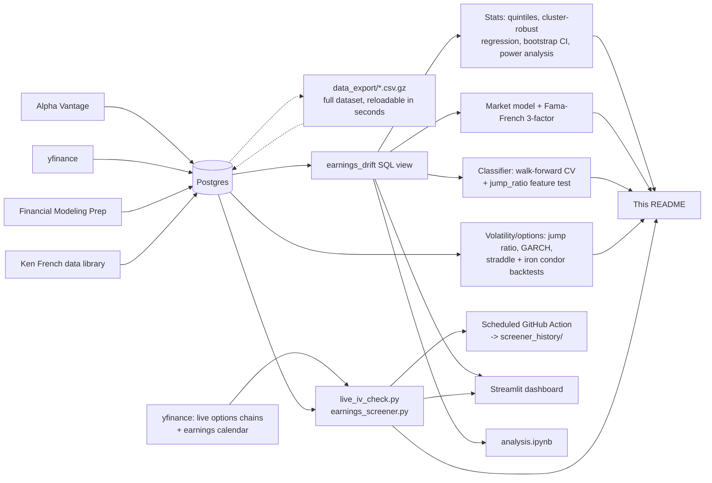
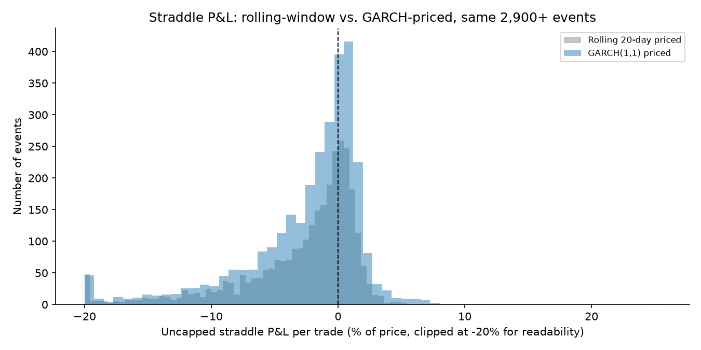
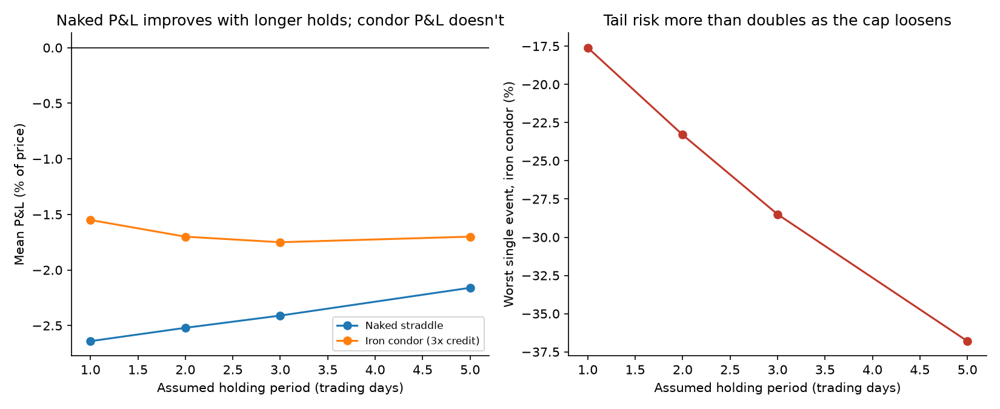
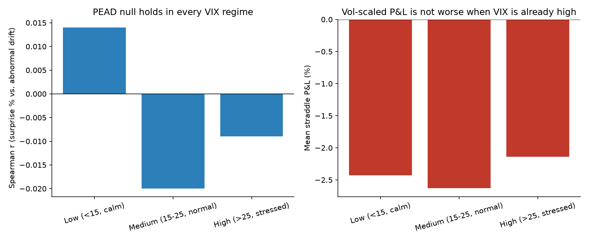

# Post-Earnings Announcement Drift (PEAD) Analysis

**TL;DR:**
- Does beating or missing earnings predict how a stock drifts afterward? Tested on 6,044 real
  earnings events across 125 stocks, 20 years of history, well over a dozen independent
  statistical methods. **No**, and the null result got stronger, not weaker, as the sample
  grew (807 -> 2,953 -> 6,044 events).
- The more useful finding was about volatility, not direction: earnings days move several
  times a normal trading day for that stock, consistently enough that a naive
  historical-volatility-priced options strategy loses money selling into it.
- A live tool (`live_iv_check.py`) closes the "no real options data" gap with real yfinance
  options chains, and got used for an actual trade - which surfaced two bugs no amount of
  unit testing had caught, then a third once the ticker universe doubled.
- Full stack: normalized Postgres schema, two APIs feeding it, a reproducible data export so
  anyone can clone and run this in seconds, CI running 20+ scripts against real data on every
  push, a `pytest` suite, and a Streamlit dashboard.
- [`WALKTHROUGH.md`](WALKTHROUGH.md) is a plain-English tour of every script,
  [`FINDINGS.md`](FINDINGS.md) is a 1-page results summary. Keep reading for the full
  methodology.

I love trading stocks and options and pay attention to how price moves around earnings, which
is why I wanted to dig into post-earnings announcement drift (PEAD): the idea that after a
company beats or misses, its stock keeps drifting that direction for days or weeks instead of
re-pricing instantly. It's a documented effect in finance research, supposedly strongest in
small, under-covered stocks and weakest in mega-caps everyone already watches. I wanted to test
that on real data instead of taking it on faith.

See [`analysis.ipynb`](analysis.ipynb) for a narrative version with charts rendered inline.

## The question

1. Does PEAD show up, and is it predictable, in real market data?
2. Does the effect get stronger as analyst coverage drops, the way the literature says it
   should? Tested against my own three-tier sample, not just cited.

## Data & methodology

Earnings surprises come from Alpha Vantage for 12 of 20 large-cap tickers, yfinance for
everything else. I validated yfinance against Alpha Vantage on overlapping data first
(surprise percentages matched within about 0.2 points) before trusting it as the primary
source - Alpha Vantage's free key stayed rate-limited over 24 hours across two calendar days,
well past its advertised reset.

Daily prices come from Financial Modeling Prep for large-caps and yfinance for mid/small-caps
(FMP's free tier only whitelists a small set of large-cap symbols). SPY is the benchmark for
abnormal drift: a stock's raw move minus the S&P 500's move over the same window, isolating
the earnings-specific reaction from whatever the broad market was doing. The market model and
Fama-French sections below pull daily market/size/value factor returns from Ken French's
public data library, the same source real academic finance research uses.

The universe is 125 stocks across three market-cap tiers (roughly 41 large / 42 mid / 42
small), spread across Tech, Financials, Healthcare, Consumer, Defense, and Industrials. It
started at 60 tickers (20/20/20); `ingest_expansion.py` roughly doubled it later, adding real,
validated names in the same tier/sector design. Price history goes back to 2006 (or IPO date)
rather than a short recent window, since Alpha Vantage's earnings history already reached back
to 1996 for large-caps.

"Day 0" is the reported earnings date if released pre-market, otherwise the next trading day.
Large-cap uses Alpha Vantage's explicit report-time field for this; mid/small-cap defaults to
post-market since that field isn't reliable from yfinance, a disclosed simplification that
holds up fine since most companies report after close anyway.

Signals tested: surprise size, 5-day pre-earnings momentum, Day-0 volume vs. the trailing
20-day average, and volatility change. Drift windows: 5, 10, and 20 trading days after Day 0.
Everything lives in a normalized Postgres schema (Docker), joined through a SQL view built on
layered window functions (`LEAD`/`LAG`, rolling `AVG`/`STDDEV_SAMP`) to compute
forward/trailing returns, volume, and volatility per ticker.



## Results

6,044 earnings events across all 125 tickers, up to 20 years of history where available.

### Quintile buckets

| Surprise bucket | Median surprise | Avg. abnormal drift (10d) | p-value |
|---|---|---|---|
| Big miss | -9.56% | +0.26% | 0.162 |
| Miss | +1.44% | +0.30% | 0.053 |
| Meet | +5.59% | +0.10% | 0.494 |
| Beat | +12.92% | +0.00% | 0.985 |
| Big beat | +38.93% | +0.49% | 0.026 |


*Bar height is average abnormal drift (10 trading days) per surprise-size bucket, big miss to
big beat. A real PEAD effect would climb left to right; these bars don't.*

A real PEAD effect should read like a staircase here. It doesn't. The "big beat" bucket's raw
p-value crosses 0.05 on its own, but that doesn't survive multiple-comparison correction
(corrected p=0.210 - see below), a pattern that keeps showing up: a test looks marginal in
isolation, then stops looking that way once you account for how many tests were run.

### Coverage hypothesis (Spearman correlation, by tier)

| Tier | Window | n events | n tickers | Spearman r | p-value |
|---|---|---|---|---|---|
| Large-cap | 10d | 2,257 | 41 | -0.004 | 0.840 |
| Large-cap | 20d | 2,257 | 41 | 0.019 | 0.363 |
| Mid-cap | 10d | 1,910 | 42 | -0.016 | 0.476 |
| Mid-cap | 20d | 1,910 | 42 | 0.015 | 0.507 |
| Small-cap | 10d | 1,877 | 42 | 0.010 | 0.665 |
| Small-cap | 20d | 1,877 | 42 | 0.020 | 0.396 |

### Cluster-robust regression (and a bug I caught mid-analysis)

Repeated events from the same company aren't fully independent, so standard errors need
clustering by ticker instead of treating everything as one pile of i.i.d. observations. My
first attempt produced a suspiciously "significant" large-cap result that contradicted the
Spearman test on identical data - two compounding problems: a handful of extreme outlier
surprise values (up to +6,567%, from near-zero EPS estimates) dominating an unwinsorized
linear fit, plus unreliable inference from only 12 ticker-clusters at the time (the rule of
thumb wants 30-50+). Fixed by winsorizing at the 1st/99th percentile and flagging any tier
with too few clusters to trust.

| Tier | Window | n | clusters | Coef | Cluster-robust p | Corrected p |
|---|---|---|---|---|---|---|
| Large-cap | 10d | 2,257 | 41 | 0.0014 | 0.822 | 0.822 |
| Large-cap | 20d | 2,257 | 41 | 0.0119 | 0.033 | 0.100 |
| Mid-cap | 10d | 1,910 | 42 | 0.0067 | 0.075 | 0.151 |
| Mid-cap | 20d | 1,910 | 42 | 0.0129 | 0.019 | 0.100 |
| Small-cap | 10d | 1,877 | 42 | 0.0031 | 0.409 | 0.490 |
| Small-cap | 20d | 1,877 | 42 | 0.0072 | 0.111 | 0.167 |

Every tier has 41-42 clusters now (large-cap started at just 12, back when it was Alpha
Vantage-only). Two numbers sit close to the raw 0.05 line - large-cap and mid-cap at 20
days - but neither survives Benjamini-Hochberg correction (both land at 0.100).

### Classifier: random split vs. walk-forward

A random 80/20 split scored 51.1% (logistic regression) and 52.6% (random forest) against a
50.4% baseline - basically a coin flip already. A random split on time-series data also risks
lookahead bias (training partly on later events to predict an earlier one), so 5-fold
walk-forward validation confirms it properly: 50.5% and 50.3% average accuracy against a 52.1%
baseline. Both sit at or below baseline in nearly every fold.

**Does adding the jump_ratio feature help?** The volatility work later in this project
engineered `jump_ratio` (the size of the Day-0 move relative to a normal day) - one of the
strongest, most significant numbers anywhere in this project (p=3.8x10⁻²⁵ in
`volatility_risk_premium.py`). `model_v2.py` checks the obvious follow-up: does feeding that
into the same walk-forward classifier help predict drift direction? Logistic regression moves
by +0.10 percentage points, random forest by +0.16 - both well under a point, still below
their own baseline. Not a contradiction: `jump_ratio` measures the *size* of the reaction, not
which way it goes, so there's no real reason it should predict direction. A feature can be one
of the strongest findings in the project by one measure and add nothing by a different one.

### Pipeline validity check

Raw drift tested against SPY's return should come back strongly significant, since most stocks
move with the broad market. It does: r=0.459, p=3.62×10⁻³¹³. Good - the null result elsewhere
isn't because the pipeline is broken.

### Event study and placebo check

Average daily abnormal return, 10 days before to 20 after Day 0, cumulated. Abnormal return
spikes right on Day 0 (+0.27% mean, vs. roughly -0.02% to +0.16% on every other day), and
day-to-day volatility more than triples (std 6.21% at Day 0 vs. 1.7-2.0% elsewhere), then the
curve goes flat. The market reprices instantly here; it doesn't drift.


*X-axis is trading days relative to the earnings reaction (Day 0); y-axis is cumulative
abnormal return. The line jumps at Day 0 and stays flat, instant repricing, not gradual
drift.*

A raw test of "any positive drift after Day 0" (ignoring surprise direction) does come back
significant on its own: mean +0.55%, p<0.0001. So I ran a placebo check - the identical test
on random non-earnings days, 100 times with different draws, instead of trusting one lucky
comparison. The real result sits in the lower half of that distribution: placebo mean +0.73%
(range +0.52% to +1.03%) vs. the real +0.55%. Empirical p-value: 0.960. That "significant"
drift isn't earnings-specific - it's this sample's general upward tendency, and random days
without any news show it just as much. Without this check I'd have reported +0.55% as
evidence for PEAD, and been wrong.


*Histogram of mean post-Day-0 CAR across 100 random-day placebo runs; the vertical line marks
the real earnings-day result, sitting inside the distribution, not off to one side.*

### Market model: proper beta-adjusted abnormal returns

Everywhere above, "abnormal drift" assumes every stock moves 1-for-1 with the market. The
actual standard (Brown & Warner 1985) estimates each stock's real beta from a clean 250-day
window before the event, with a 30-day gap so the event can't leak into the estimate. Average
beta here is 1.04 (median 1.02) - these stocks move roughly in line with the market now that
the universe is broader, so the simpler method was crediting whatever extra beta-driven
sensitivity existed to "abnormal" earnings movement. Beta-adjusted, the post-Day-0 drift stays
small and insignificant: mean CAR change Day 0 to Day +20 is +0.091% (p=0.389), a cleaner
confirmation of what the placebo check already found.

### Fama-French 3-factor model

The market model only controls for beta. Fama & French (1993) also controls for size (SMB)
and value (HML), using free daily factor data from Ken French's library - same pre-event
window and 30-day gap, three factors instead of one. CAR is +0.337% at Day 0 and actually
declines to +0.271% by Day +20 rather than climbing; the continuation test isn't significant
(mean -0.066%, p=0.504). The most sophisticated model tried here agrees with everything else.

### Multiple comparison correction

Applied separately to the 8 quintile/tier tests and the 6 cluster-robust regressions. Nothing
survives either family, the same pattern reproducing across every sample size as the dataset
grew from 807 to 2,953 to 6,044 events.

### Sector cut, and other signals

Sliced by sector instead of tier: no result is even marginal on its own anymore (smallest raw
p is Financials at 0.190, all six corrected to 0.870). Volume spike and volatility change,
the other two features this pipeline computes, don't predict drift either, in any tier (all
corrected p-values above 0.33).

### Was this test even powerful enough to find something?

A null result only means something if the test could have detected a real effect had one
existed. Using a Fisher z-transform power calculation, the tier-level tests (n=1,877 to 2,257,
up from n=835-1,237 before widening the universe) could reliably detect a Spearman correlation
as small as 0.059-0.065 at 80% power - comfortably under 0.1, Cohen's threshold for a "small"
effect. Every observed correlation sits below even that tighter bar. The two thinnest sector
splits, Defense (12 tickers) and Industrials (16), land right at the edge (thresholds of 0.116
and 0.102) rather than clearly underpowered the way they were at 4-6 tickers each, and their
observed correlations are still smaller than their own detection threshold. Not an underpowered
test missing something real - it just didn't find anything.

### Does it even make economic sense to trade?

Statistical and economic significance are different questions. The most obvious naive PEAD
trade - long the "big beat" quintile, short "big miss" - nets a gross spread of +0.23% before
costs, and about -0.17% after a 20bps round-trip cost assumption per leg. Not tradeable by any
standard, on top of never being significant to begin with.

### A real equity curve, not a pooled average

The naive strategy above is one pooled number across 2,412 qualifying trades, which hides what
actually matters if you traded this through time: does it blow up, and by how much, along the
way? `backtest_equity_curve.py` sequences every trade by its Day-0 date and compounds a real
equity curve instead of averaging.

First pass used a plain cumulative sum of returns, which produced a max drawdown of -494% -
impossible for real capital without leverage, and the tell that a raw cumsum is the wrong way
to compound sequential returns. Switching to `(1 + return).cumprod()` fixed the math but
surfaced a second problem underneath: modeled as one trade betting the full account in
sequence, the corrected curve still hit exactly -100%, a total wipeout. Not a finding about
PEAD - that's what any strategy does to an undiversified account, good or bad. Sizing each
trade at 10% of capital (a stand-in for a book holding several positions at once) removes the
artifact:

| Metric | Value |
|---|---|
| Trades | 2,412 (1,203 long, 1,209 short) |
| Span | 19.8 years, ~122 trades/year |
| Mean return per trade (net of cost) | -0.29% |
| Annualized Sharpe ratio | -0.44 |
| Max drawdown | -58.1% |
| Win rate | 46.5% |
| Total compounded return | -52.7% |


*Wealth index over time (starting value = 1.0) for the naive long-beat/short-miss strategy,
compounded trade by trade at 10% position sizing. Trends down, not up.*

A tradeable long-short strategy generally wants a Sharpe comfortably above 1.0. This one's
negative - no statistical edge, no economic edge, no risk-adjusted edge either.

### Volatility around earnings: the part that actually matters for selling options

Everything so far asks whether the *direction* of a surprise predicts what happens next -
the PEAD question. It's not, though, the question I care about when selling calls or puts
around an earnings date, which is really about how much the stock moves that day, not which
way. `volatility_risk_premium.py` measures that directly: for every event, it compares the
size of the Day-0 move to that stock's own trailing 20-day normal daily move.

There's no options-chain data in this project, so implied volatility isn't directly
measurable. What the price data already in the database can show is the realized side: the
earnings-day move averaged 2.28x a normal day for that stock (1.19x at the geometric mean, the
fairer summary given how right-skewed the ratio is), beating a normal day outright 59.7% of
the time. A one-sided test on the log ratio confirms this isn't noise (t=10.34, p=3.78x10⁻²⁵).
By tier, the jump is largest in mid/small-caps (2.47x mean each) and smallest in large-caps
(1.95x) - the same coverage pattern showing up again, through a different lens.

| Tier | n events | Mean jump ratio | Median jump ratio |
|---|---|---|---|
| Large-cap | 2,269 | 1.95x | 1.15x |
| Mid-cap | 1,911 | 2.47x | 1.51x |
| Small-cap | 1,889 | 2.47x | 1.43x |


*Left: distribution of the jump ratio (earnings-day move / normal-day move); dashed line
marks 1.0x, a normal day. Right: the same ratio split by tier.*

Sector is a dimension tier can't see, since every tier mixes all six sectors together:

| Sector | n events | Mean jump ratio |
|---|---|---|
| Tech | 1,528 | 3.35x |
| Healthcare | 950 | 2.38x |
| Consumer | 1,128 | 2.18x |
| Defense | 584 | 1.68x |
| Industrials | 747 | 1.65x |
| Financials | 1,132 | 1.55x |

Tech runs hottest by a wide margin, more than double most other sectors. Widening the universe
changed the bottom of this ranking: Defense used to be the calmest sector (0.96x, on the
original 4 tickers); Financials is calmest now (1.55x), with Defense actually third-hottest
once RTX, NOC, GD, and the other new Defense names came in with more typical reactions than the
original small sample had. A 4-6 ticker sector can flip its ranking entirely once the sample
gets more representative - a real argument for trusting the thinnest splits the least.

This is exactly why options carry elevated implied volatility into an earnings date: the
market is pricing in that a normal day badly understates what's coming. It doesn't tell me
whether that elevated IV is priced *too* high on average - that needs real option prices this
project doesn't have. But the PEAD result above still matters here: since drift after Day 0 is
indistinguishable from zero, the earnings-day move behaves like a one-time jump rather than
the start of a multi-day trend, the cleaner setup for a defined-risk premium-selling trade.

### Would selling a historical-vol-priced straddle actually have worked?

The jump ratio says the earnings-day move is real and large. `straddle_backtest.py` takes the
next step: price an at-the-money straddle off trailing historical volatility only, no
options-chain data, via the Brenner & Subrahmanyam (1988) approximation (straddle price ≈ 0.8
x price x daily volatility for a one-day option), sell it into every one of these 6,069
events, see what happens.

It loses money, clearly and consistently: mean P&L of -2.49% of the stock's price per trade
(p<0.0001), a 33.5% win rate, losses in every tier (large -1.79%, mid -2.86%, small -2.96%).
Implied vol would need to run at roughly 2.5x the trailing historical level just to break even.


*Left: distribution of per-event P&L (% of stock price); mass sits well left of zero. Right:
mean P&L by tier.*

By sector, a similar but not identical pattern to the jump ratio shows up:

| Sector | n events | Mean P&L | Win rate |
|---|---|---|---|
| Tech | 1,528 | -4.47% | 20.7% |
| Consumer | 1,128 | -2.54% | 34.8% |
| Healthcare | 950 | -2.52% | 34.7% |
| Defense | 584 | -1.51% | 41.1% |
| Industrials | 747 | -1.16% | 41.1% |
| Financials | 1,132 | -1.14% | 39.7% |

Tech is worst to sell into by a wide margin, same as the jump ratio. Financials now comes
closest to breakeven (-1.14%), while Defense and Industrials tie for the best win rate
(41.1%) - a reorder from the original 60-ticker run, where Defense alone looked like a coin
flip. Same reshuffle as the jump-ratio table: a thin sector sample moved once real tickers
were added, not a sign the old numbers were wrong, just less stable with fewer names behind
them.

This isn't a real counterexample to selling options for a living. The price here is
deliberately the cheapest reasonable price for the straddle, since it ignores what the market
actually knows going into an earnings date - real implied volatility runs above historical
volatility for exactly the reason measured above. A 2.5x multiplier is within the range real
earnings IV run-ups reach in practice. What this shows is a lower bound: if implied vol isn't
priced at least a few multiples over historical, you're picking up a bad number, and whether
real-world IV clears that bar profitably is a question only options-chain data could answer.

### Iron condor: does capping the loss actually change the picture?

The straddle backtest modeled a naked short straddle, undefined risk - not how most people who
trade earnings actually size a position, since undefined risk needs far more margin and one
bad print can wipe out weeks of gains. `iron_condor_backtest.py` reruns the same backtest with
the loss capped by protective wings, set at 3x the credit received, a representative
defined-risk setup rather than a fitted parameter. It keeps the same credit as the straddle
version and only caps the downside, which overstates the condor's real edge somewhat since
real wings cost part of the credit to buy.

| | Mean P&L | Worst single event |
|---|---|---|
| Naked straddle (uncapped) | -2.49% | -50.1% |
| Iron condor (3x credit cap) | -1.45% | -17.6% |

Capping the loss doesn't just trim the tail, it improves the average too - the naked version's
left tail is fat enough that a handful of catastrophic events drag the average down harder than
the typical trade. The cap bound on 23.0% of events, and the pattern holds across wing widths
(2x to 6x credit; see the script output for the full table).


*Overlapping P&L distributions for the uncapped and capped versions of the same trade. Capping
trims the fat left tail without shifting the average sign.*

The average outcome is still negative either way, so this isn't a case for earnings condors as
a reliable edge. It's a concrete illustration of why real options traders size earnings
positions with defined risk: not because it improves the expected outcome, but because it
keeps a single bad print from being the one that matters.

### GARCH(1,1): does a real volatility-forecasting model change the story?

Every volatility number so far uses a 20-day rolling standard deviation as "normal" volatility
- a reasonable baseline, but real volatility forecasting usually accounts for volatility
clustering (calm and choppy periods persisting) instead of weighting the last 20 days equally.
`garch_volatility_forecast.py` fits a GARCH(1,1) model (Bollerslev 1986) per ticker to check
whether a more sophisticated model changes the jump-ratio and straddle-pricing conclusions.

One caveat: the market model and Fama-French sections fit only on a clean pre-event window to
avoid lookahead bias. Refitting GARCH before each of ~6,000 individual events would be its own
project, so this fits one GARCH model per ticker on its full history instead (125 tickers,
each fit in well under a second) - the fitted parameters carry mild lookahead bias, even
though each daily forecast only uses information through the prior day. Good enough to ask
whether a smarter model changes the conclusion, not a substitute for the point-in-time
discipline used above.

The two volatility estimates agree in shape (Spearman r=0.896) but aren't the same number.
GARCH comes out closer to the realized move: geometric mean jump ratio drops from 1.19x
(rolling window) to 1.00x (GARCH), and the straddle's breakeven multiplier drops from 2.54x to
2.18x. The rolling-window ratio is still statistically real (t=10.34, p=3.8x10⁻²⁵), but at
this wider sample the GARCH-based ratio is no longer distinguishable from 1.0 (t=0.17,
p=0.43) - a different result from the original 60-ticker check, not just a smaller version of it.


*Left: rolling-window vs. GARCH(1,1) daily volatility estimates, one dot per event, dashed
line is y=x. Right: geometric-mean jump ratio under each method.*

That doesn't mean GARCH-priced straddles stop losing money, and it's worth spelling out why:
Brenner-Subrahmanyam prices the straddle at *0.8x* daily volatility, not 1.0x. Even a jump
ratio averaging almost exactly 1.0 (a "normal" day, by GARCH's own reckoning) still means the
realized move typically exceeds the 0.8x-scaled premium collected - the trade keeps losing on
average even though the narrower "is the jump ratio above 1" claim no longer holds up alone at
this sample size. A better model gets closer to realistic but doesn't close the gap, since
neither model has any way to know an earnings date is coming - both are purely backward-
looking. That remaining gap is the volatility risk premium options markets price in ahead of
an earnings date, information a time-series model structurally can't have.

`garch_volatility_forecast.py` only reported that gap as a single summary statistic, never
rebuilt the straddle and iron condor backtests with GARCH pricing end to end.
`garch_straddle_backtest.py` closes that: same 6,069 events, same Brenner-Subrahmanyam
formula, same 3x-credit iron condor cap, priced off GARCH volatility instead of the rolling
window - apples to apples rather than two scripts on two different samples.

| | Rolling 20-day | GARCH(1,1) |
|---|---|---|
| Mean P&L, naked straddle | -2.49% | -2.22% |
| Win rate | 33.5% | 37.9% |
| Breakeven IV multiplier | 2.53x | 2.17x |
| Mean P&L, 3x-credit iron condor | -1.45% | -1.44% |
| Worst single event, iron condor | -17.6% | -18.9% |

Per-event P&L from the two pricing methods correlates at 0.98, and the tier pattern holds in
both (small/mid-cap worst, large-cap least bad). GARCH pricing is measurably less bad across
every metric, and both remain overwhelmingly significant on the P&L test itself (GARCH:
p=1.2x10⁻²⁷⁰) - consistent with the single-ticker check finding it a better volatility
estimate, not a coincidence of which tickers that check happened to use. Doesn't flip the
conclusion: selling this trade priced off either method loses money on average, capped or
naked.



*Overlapping P&L distributions for the same events, rolling-window vs. GARCH(1,1) pricing.
GARCH shifts the distribution right (less bad) without changing its sign.*

### Does the earnings-day volatility spike actually linger afterward?

Does the Day-0 spike bleed into the following two weeks, the way volatility clustering usually
works, or snap back to normal fast? The `earnings_drift` view already computes
`volatility_change_ratio` for this (10-day realized volatility after Day 0, over 20-day before
it); `volatility_crush_check.py` made it the headline.

The geometric mean ratio is 0.93, median 0.93, both below 1, confirmed with a one-sided test
on the log ratio (t=-12.75, p=4.8x10⁻³⁷). If anything, realized volatility in the ten days
after an event runs slightly *below* the stock's normal level (the arithmetic mean, 1.03, sits
just above 1, but that's right skew from a handful of large spikes - why the geometric mean is
the fairer summary). Doesn't depend on surprise size either (Spearman r=0.016 against
`|surprise %|`, p=0.205); the reversion looks like a universal pattern, not something
proportional to how big the news was.


*Left: distribution of the volatility-change ratio (10 days after / 20 days before); dashed
line at 1.0 marks no change. Right: the same ratio split by tier.*

Combined with the flat post-Day-0 drift and the volatility jump concentrating almost entirely
on Day 0, this is the same "one-time jump, not a regime change" story a third way - whether
measured as price drift or volatility. For anyone holding a short-vol position, the risk here
sits overwhelmingly in the event day itself, not the days after.

### Bootstrap confidence intervals: does clustering matter here too?

The cluster-robust regression above showed treating repeated events from the same company as
independent understates uncertainty. `bootstrap_confidence_intervals.py` checks whether that
applies to a different tool: a bootstrap CI around the tier-level Spearman correlations. Naive
resamples individual events; cluster resamples whole companies, keeping every quarter from a
ticker together.

I expected the cluster interval to come out wider everywhere, the same story as the
regression. Only half true:

| Tier | Observed r | Naive 95% CI width | Cluster 95% CI width | Cluster / naive |
|---|---|---|---|---|
| Large-cap | -0.004 | 0.090 | 0.092 | 1.02x |
| Mid-cap | -0.016 | 0.096 | 0.093 | 0.97x |
| Small-cap | 0.010 | 0.097 | 0.080 | 0.82x |

Large-cap comes out about the same; mid/small-cap actually come out *narrower* under cluster
resampling. Reproduces with a different seed and resample count, so it's real, not noise. Best
explanation: the regression's cluster-robust SE corrects for correlated residuals within a
company, while this resamples whole companies for a rank correlation computed once over the
pooled tier - a different kind of object, and the quarter-to-quarter pattern here just isn't as
internally correlated as those residuals were. Both intervals still comfortably straddle zero
either way, so the conclusion doesn't move, but "clustering widens the interval" turned out to
depend on which statistic you're clustering.

### Does the holding-period lesson from the live tool generalize?

Fixing `live_iv_check.py` for a real trade (see "Two more bugs" below) exposed a blind spot in
every backtest above: `straddle_backtest.py` and `iron_condor_backtest.py` both price and
resolve every trade over a single day, but a real option's holding period isn't always 1
trading day, and the extra days add real, independent variance. `holding_period_sensitivity.py`
applies that lesson to the full 20-year, 125-ticker dataset: reprice both backtests at 1, 2, 3,
and 5 trading days of assumed holding period and see if the conclusion holds.

| N (trading days) | Events | Mean P&L, naked | Win rate | Breakeven IV multiple | Mean P&L, condor | Worst event, condor |
|---|---|---|---|---|---|---|
| 1 | 6,068 | -2.64% | 30.9% | 2.77x | -1.55% | -17.6% |
| 2 | 6,065 | -2.52% | 35.4% | 2.20x | -1.70% | -23.3% |
| 3 | 6,061 | -2.41% | 37.4% | 1.93x | -1.75% | -28.5% |
| 5 | 6,055 | -2.16% | 41.5% | 1.65x | -1.70% | -36.8% |

I expected longer holding periods to make things worse, the way it did for GOOGL specifically
that night. Across the whole dataset it's the opposite for the naked position: mean P&L
improves and the breakeven multiple needed drops as N grows. Ties back to the volatility-crush
finding above - Brenner-Subrahmanyam's sqrt(T) scaling assumes the same daily volatility holds
every day of the holding period, but realized volatility after an event reverts toward normal
(geometric mean ratio 0.93), not staying elevated. Pricing a longer straddle as if every day
were as volatile as the event day over-collects premium for the calmer days that follow, which
works in the seller's favor here, historically.

The iron condor tells a different, cautionary story: capped mean P&L gets *worse* with a
longer holding period, and the worst single event more than doubles (-17.6% to -36.8%). The
wing cap is a multiple of the credit collected, and since that credit grows with sqrt(N) faster
than the "fair" price for the calmer later days does, the cap loosens faster than the real risk
does, letting bigger tail losses through. A real defined-risk structure would need wing width
set by expected volatility per day, not a flat multiple of an already-overstated credit - the
same lesson from the live bug, showing up again structurally.



*Left: mean P&L (naked vs. iron condor) as holding period grows from 1 to 5 trading days.
Right: the iron condor's worst single event over the same range.*

(Simplification, disclosed: this anchors on the raw report date for every ticker, N trading
days later, rather than each ticker's own pre/post-market-adjusted reaction date. For
post-market reporters, most of this universe, N=1 lines up with the existing day0-only
scripts; for pre-market reporters it's a day later. Fine for a sensitivity check, not a
byte-for-byte reproduction of those scripts' N=1 case.)

### Does any of this depend on the broader market's mood?

Every test above pools 20 years together, calm and stressed markets alike.
`vix_regime_analysis.py` pulls in the VIX index (free via yfinance, decades of history), a
variable this project hadn't used before, and conditions both headline questions - surprise
predicting drift, and premium-selling paying off - on the market-wide volatility regime, using
standard VIX bands rather than sample-dependent terciles.

| VIX regime | n events | Spearman r (surprise vs. drift) | p-value |
|---|---|---|---|
| Low (<15, calm) | 2,217 | 0.014 | 0.524 |
| Medium (15-25, normal) | 3,018 | -0.020 | 0.268 |
| High (>25, stressed) | 809 | -0.009 | 0.788 |

The PEAD null holds in every regime individually, not just on average (pooled r=-0.004,
p=0.737, same order of magnitude as each slice): no calm-market or stressed-market subset where
surprise size starts predicting drift.

| VIX regime | Geo-mean jump ratio | Mean straddle P&L | Win rate |
|---|---|---|---|
| Low (<15, calm) | 1.24x | -2.43% | 32.5% |
| Medium (15-25, normal) | 1.21x | -2.63% | 33.9% |
| High (>25, stressed) | 1.00x | -2.14% | 35.1% |



*Left: Spearman correlation (surprise vs. drift) by VIX regime, all near zero. Right: mean
straddle P&L by the same regimes, not worse in the high-VIX bucket.*

I expected the opposite: a short-vol earnings position at its worst exactly when the broader
market is already stressed, a double whammy rather than a diversifying bet. Instead the jump
ratio is smallest and straddle P&L is least bad in the high-VIX bucket. Reconciliation: both
the jump ratio's denominator and the straddle's price are keyed off the same trailing 20-day
volatility for that stock, and single-stock realized vol is itself elevated in high-VIX
regimes, not just the index. The "normal day" baseline these percentage-based metrics compare
against is already inflated when VIX is high, which mechanically shrinks the relative jump
ratio and richens the credit collected - a property of vol-scaled metrics, not evidence that a
stressed market makes earnings positions safer in absolute terms.

## Interpretation

No significant relationship between surprise size and abnormal drift, in any tier, across
every method tried. The coverage hypothesis didn't hold up either: every tier stayed
indistinguishable from zero, and more than doubling the sample size (twice - once as the
original backtest matured, again after widening the universe) converged estimates closer to
zero, not further. That's the signature of a genuinely absent effect, not an underpowered test.

The placebo check is the strongest single piece of evidence here: a result that looks
significant on its own can be fully explained by general sample drift that has nothing to do
with earnings, and testing for that directly, instead of trusting a small p-value at face
value, is what separates a credible result from a false positive. Part of why that general
drift exists at all is survivorship bias (see below) - this universe is companies still around
and doing well today, not a random sample of everything that existed back to 2006.

That null result answers the PEAD question this project set out to test. It doesn't answer the
personal question that motivated it, though. Reframed around volatility instead of direction,
the same data shows something real: earnings days move several times a normal trading day
(confirmed under two volatility models, rolling window and GARCH), that jump doesn't linger
into the following two weeks, and a historical-vol-priced options trade sold into it loses
money consistently enough to be statistically undeniable. None of that is a trading strategy -
there's no options-chain data here to say whether real implied volatility is priced richly
enough to sell profitably - but it's a real, sector-varying pattern (Tech hottest, Financials
calmest) a purely directional PEAD test would never have surfaced, and it holds up whether the
market is calm or stressed. `live_iv_check.py`, below, closes that gap with real options data
instead of leaving it a permanent disclaimer.

## Live check: is the market pricing this correctly right now?

Every volatility section above ends on the same disclosed limitation: no options-chain data,
so nothing in the backtest can say whether real implied volatility is priced richly enough to
sell. `live_iv_check.py` closes that gap using yfinance's free live options chains and
earnings calendar, for the tickers I actually trade (HOOD, NVDA, GOOGL by default, though it
takes any symbol).

For each ticker it finds the next earnings date, prices the at-the-money straddle on the
nearest expiration, and isolates the earnings-specific piece of that price using variance
additivity: subtract out the variance this stock's own near-term volatility would explain over
the non-earnings trading days between now and expiration, since an option priced weeks out
mostly reflects ordinary day-to-day movement. It then compares that isolated expected move to
the ticker's own historical earnings-day pattern (the same `jump_ratio` from
`volatility_risk_premium.py`, scaled by current volatility) for a "richness ratio": is the
market pricing in more or less movement than this stock has actually delivered on past
earnings days?

That near-term volatility estimate uses a fresh GARCH(1,1) forecast per ticker, falling back
to the rolling window only if the fit fails or there's too little history, since GARCH already
showed it tracks realized moves better. Scoped to just that one step, though: the historical
ratio itself was computed against rolling-window volatility throughout history, so scaling it
by a different method's current-vol estimate would compare apples to oranges - swapping in
GARCH only where it doesn't create that inconsistency.

Run on 2026-07-22, the morning of GOOGL's earnings and a week before HOOD's:

| Ticker | Earnings date | Nearest expiration | Historical typical move | Market-implied move | Richness |
|---|---|---|---|---|---|
| GOOGL | 2026-07-22 | 2026-07-24 (2 trading days out) | 7.08% | 5.46% | 0.77x cheaper |
| HOOD | 2026-07-29 | 2026-07-31 (7 trading days out) | 11.08% | 5.69% | 0.51x cheaper |
| NVDA | 2026-08-26 | 2026-08-28 (27 trading days out) | - | - | skipped, too far out |

NVDA is the honest part of this: earnings are over a month away, no closer weekly option
exists yet, and netting out a month of assumed-constant daily volatility is too shaky an
assumption to trust. The script detects this case (nearest expiration more than 10 trading
days out) and says so rather than showing a number. That case surfaced a real bug during
development: the naive version subtracted out more variance than the whole option price
contained, making the earnings-specific variance negative and its square root undefined. Fixed
by clipping at zero, and refusing to report a result once the expiration is far enough out
that the whole approach isn't trustworthy anymore.

### Two more bugs found by actually using this for a real trade

Everything above held up fine in testing. It took an actual GOOGL earnings trade, the night
before, to find the next two, and they weren't cosmetic.

**Wrong contract, silently.** GOOGL reports after market close. The nearest expiration on or
after the raw earnings date from yfinance's calendar was, in this case, the *same calendar day*
as the earnings date - a contract that settles at that day's close, hours before the
after-hours reaction exists. Real volume and open interest confirmed nobody trades that one for
this purpose; they use the next expiration out. yfinance's calendar has no pre/post-market
flag, so nothing signaled the tool had picked wrong. Fixed with data this project already had:
`earnings_events` records `report_time` for every historical report, and GOOGL has reported
post-market 100% of the time on record, so that history now shifts the reaction date forward a
trading day before picking an expiration.

**Wrong historical comparison, less obviously.** The historical baseline only ever measured a
single day's move (day0), but the live option runs however many trading days actually pass
between the report and expiration - not always the same number, even for the same ticker in
different quarters. For GOOGL that gap is 2 trading days, and the extra day adds real,
independent variance (measured directly: the historical spread nearly triples once the second
day is included). Fixed by measuring the *cumulative* historical move over exactly as many
trading days as the live option has left, per ticker, per check. Both fixes came from a
`shift_to_reaction_date()` and `historical_cumulative_jump_stats()` addition, tested the same
way as the rest of this project's math (`tests/test_live_iv_check.py`).

The combined effect wasn't small: GOOGL initially showed **1.44x richer** than its own history.
Properly aligned, it actually shows **0.74x cheaper**. Same ticker, same night, opposite
conclusion, because the first version was quietly comparing against the wrong thing twice.
That's the strongest argument in this project for why a live tool that gets used for something
real matters more than one that only gets unit tested - real use is what found this, not the
test suite.

### Scaling it up: a screener across the whole universe

`live_iv_check.py` checks one ticker at a time. `earnings_screener.py` runs the same comparison
across all 125 tracked tickers and ranks the results, surfacing whichever upcoming earnings
look most mispriced relative to that stock's own history. Two passes: a cheap calendar-only
check on all 125 tickers to find who reports soon, then full options-chain pricing on that
shorter list.

Run the morning of GOOGL's earnings, scanning the next 30 days: 67 of 125 tickers qualified,
14 produced a usable comparison after skipping names with no historical baseline, no options
data, or an unreliable netting assumption:

| Ticker | Richness ratio |
|---|---|
| RTX | 3.98x richer |
| LMT | 3.06x richer |
| BA | 1.90x richer |
| TDOC | 1.67x richer |
| GD | 1.52x richer |
| DECK | 1.42x richer |
| MSFT | 1.40x richer |
| AMZN | 1.10x richer |
| INTC | 0.79x cheaper |
| GOOGL | 0.77x cheaper |
| META | 0.62x cheaper |
| TSLA | 0.61x cheaper |
| HOOD | 0.48x cheaper |
| IBM | 0.15x cheaper |

RTX stands out (3.98x, reporting the next day), and IBM is priced cheapest relative to its own
history by a wide margin (0.15x). LMT and BA, two of the original three Defense names, are
still near the top of the "richer" side, joined now by RTX and GD from the expansion - showing
up here on their own, not hand-picked.

Building the screener (originally against the 60-ticker universe) surfaced a second bug, more
general than the first: even inside the 10-trading-day "reliable" horizon, if a stock's recent
realized volatility runs hot relative to its near-term option prices, the same variance
subtraction can still clip to zero. AAPL hit this live during development (8 trading days out,
comfortably inside the horizon, still clipped) - proximity to the event doesn't guarantee the
netting assumption holds. Fixed with a direct check (`would_clip_to_zero` in `backtest_math.py`,
unit tested against this exact case) instead of relying on proximity as a safety net.

Widening the universe surfaced a third: four thinner new names (FMBH, LKFN, MMSI, SCHL) crashed
with a raw `IndexError` instead of a clean skip. Their nearest listed expiration had zero call
or put contracts, something none of the original 60 tickers happened to trigger, so indexing
into "the closest strike" assumed at least one contract would always exist. Fixed the same way
as the other two: extracted the check into its own tested function
(`chain_has_no_contracts` in `backtest_math.py`) instead of waiting to find more of these by
hand.

This is descriptive context from this project's own historical data, not a trading signal, and
neither script is reproducible the way everything else here is - they query live market data
and today's earnings calendar, so numbers change with prices, dates, and available expirations.
That's the point: every other script answers a fixed historical question; these are meant to
actually be rerun before a real trade. Same comparison for a hand-picked list of tickers is
also built into the dashboard (button-gated, cached 15 minutes), for anyone who'd rather click
than run a script.

### Running the screener on a schedule

Now that the full dataset loads in seconds, running the historical baseline query in CI stopped
being a blocker. `.github/workflows/screener_history.yml` runs `earnings_screener.py` on a
schedule (weekdays, 12:00 UTC, plus manual triggering) against a freshly loaded database, and
commits whatever it finds to `screener_history/YYYY-MM-DD.md`. The point isn't automation for
its own sake - it's that these two scripts are the one part of this project meant to be rerun
regularly, and a scheduled job that keeps every day's result, including the uninteresting
skips, is a more honest record than remembering to run it by hand. A failed run (yfinance
unreachable or rate-limiting) just means a missing day, not bad data.

## Limitations

- Survivorship bias: this universe was picked as well-known companies today, excluding
  anything that got delisted or went bankrupt along the way. The median ticker roughly matched
  the market over its full history and the mean is far above it (`survivorship_check.py`), so
  this sample was never representative of "the market," and that inflates the general upward
  drift the placebo check measured against
- Mid/small-cap Day-0 timing defaults to "post-market" rather than a confirmed report time
- A handful of originally-targeted small-cap tickers got dropped for lack of historical data
  density - a small sign that lower-coverage stocks have thinner historical records
- The market-model and Fama-French estimates need a clean ~280-day window; 98 of 6,044 events
  don't have one and are excluded from just those two analyses. Ken French's factor data
  currently ends in May 2026, about two months before this project's price data, so the most
  recent events lose Fama-French coverage first
- Each test family was corrected for multiple comparisons within itself; a stricter version
  would correct across all families jointly. Every family already came back null, so it
  wouldn't change the conclusion, but it's the more rigorous option
- The equity-curve backtest sizes every trade independently at 10% of capital and doesn't
  model overlapping positions, which a real trading book would need to handle
- The volatility jump analysis and straddle backtest both measure realized moves only - no
  options-chain data means neither can say whether real implied volatility is priced richly
  enough to be profitable, just that the realized jump is large and real, and historical vol
  alone isn't a good enough price to sell
- The straddle backtest ignores bid/ask spread, commissions, assignment/pin risk, and closing
  a position early instead of holding to expiration
- The bootstrap confidence intervals use 5,000 resamples per tier; more would narrow Monte
  Carlo noise further, though the qualitative pattern already reproduces across seeds and
  resample counts
- The GARCH(1,1) model is fit once per ticker on its full history rather than point-in-time
  before each event, unlike the market-model and Fama-French sections. Fitted parameters carry
  mild lookahead bias, even though the daily forecast itself only uses information through the
  prior day
- The iron condor backtest holds credit fixed at the straddle's price and only caps the loss;
  a real condor's net credit is lower since part of it buys the wings, overstating the edge
  somewhat. The 3x wing multiplier is representative, not fitted
- `live_iv_check.py` and `earnings_screener.py` assume daily volatility stays roughly constant
  until the event, when real IV often creeps up beforehand. They pick the strike nearest spot
  rather than true delta-50 ATM, use bid/ask midpoint pricing that can be stale for illiquid
  strikes, and per-ticker samples are small for newer names (HOOD has just over a decade of
  quarters). Results only show when the nearest expiration is within 10 trading days and the
  variance subtraction doesn't clip to zero
- The scheduled screener depends on yfinance's undocumented endpoints staying reachable from
  GitHub's runners; an occasional failed day is expected and not treated as more than a missing
  snapshot

## What this demonstrates

**Data engineering** - two earnings APIs and two price APIs feeding a normalized Postgres
schema in Docker; idempotent ingestion with real error handling (a third-party API returned a
rate-limit notice with an HTTP 200 instead of an error code, so my first version silently
treated it as "zero results"); data quality checks, including one that caught a real bug (a
Postgres NUMERIC/NaN sorting issue that corrupted raw SQL query results, traced to 22
yfinance rows and fixed at the source); lineage tracking; a SQL view built on window functions
instead of pulling everything into Python; a standalone SQL showcase (`queries.sql`) answering
real business questions in pure SQL; and a committed, compressed export of the full 643K-row
dataset so cloning this repo gets anyone to a working database in seconds instead of days of
rate-limited re-ingestion, verified by loading it into a disposable Postgres container and
confirming every downstream number matched.

**Statistics** - quintile bucketing; cluster-robust regression with an outlier-driven false
positive diagnosed and fixed along the way; a market-beta validity check; walk-forward
cross-validation instead of a leaky random split; Benjamini-Hochberg correction across three
test families; an event-study CAR with a 100-run placebo control that caught a result that
looked real but wasn't; a naive trading strategy priced against realistic costs; a
survivorship-bias check; a formal power analysis; a Fama-French 3-factor model; a compounded
equity-curve backtest with Sharpe ratio and max drawdown; a volatility jump analysis reframing
the dataset around what matters for selling options; a Brenner-Subrahmanyam options-pricing
backtest and its defined-risk (iron condor) variant; a GARCH(1,1) model checked against the
rolling-window estimate and carried through to a full repricing of both backtests; a
volatility-persistence check; bootstrap confidence intervals comparing naive to cluster-level
resampling; a VIX market-regime cut, a new conditioning variable rather than another slice of
the same ticker data; and a feature-engineering follow-up checking whether the volatility
work's strongest signal helps a classifier predict direction (it doesn't, reported either way).

**Live data integration** - `live_iv_check.py` pulls real-time options chains and earnings
calendars from yfinance, decomposes an option price into its earnings-specific component via
variance additivity, and compares that to each ticker's own historical pattern, something to
actually rerun before a trade rather than a one-time report. `earnings_screener.py` scales that
across the full 125-ticker universe (cheap calendar check first, expensive options pricing
only for near-term reporters), reusing `live_iv_check.py`'s comparison function directly so the
two can't drift apart. Both use a live GARCH(1,1) forecast for volatility-netting, applied only
where it doesn't mix inconsistent methods. Actually using this for a real trade surfaced two
further bugs invisible to testing alone (wrong contract for after-hours reporters; wrong
historical holding period) - both fixed, both covered by `tests/test_live_iv_check.py`.

**Software practices** - a `pytest` suite that independently recomputes expected values from
synthetic fixtures and checks the SQL view exactly; a second suite of pure unit tests
(`backtest_math.py`) covering the shared compounding, loss-capping, and options-pricing math,
hand-calculated independently of the implementation; `ruff` and `mypy` wired into CI alongside
the test suite and a smoke-test of 20+ analysis scripts against real data on every push; a
`Makefile` for common commands; a Streamlit dashboard covering both tracks plus a live
options-chain section (button-gated, cached 15 minutes, verified with
`streamlit.testing.v1.AppTest`), with a static-snapshot fallback for when there's no database;
a narrative Jupyter notebook; a shared `db.py` module the 25+ analysis scripts all import
instead of repeating connection boilerplate; and a second scheduled GitHub Actions workflow
that loads the full dataset, runs the screener, and commits results back (`[skip ci]` so the
bot's own commit doesn't trigger a redundant test run).

A few of the bugs above are worth calling out specifically for how they were caught, not just
that they existed: the test suite once had a fixture that assumed a date range would always be
free of real data - true when written, false once real price history was extended further
back, so running the tests quietly deleted real production data as a side effect. Caught by
comparing row counts before and after instead of trusting "tests passed," then fixed by having
the fixture back up and restore whatever's actually there. And the equity-curve backtest's
first version used a plain running sum instead of proper compounding, producing a mathematically
impossible -494% drawdown - the kind of implausible number that's usually a bug, not a finding,
and was.

## Running it

```bash
./setup.sh   # starts Postgres, creates the venv, installs deps, applies schema+view
```

There's also a `Makefile` (`make lint`, `make test`, `make pipeline`, `make dashboard`) wrapping
the commands below.

**Fast path, no API keys needed:** getting from an empty database to a working one the "real"
way means re-ingesting 20 years of data across 125 tickers through free, often rate-limited
APIs (Alpha Vantage's key alone stayed rate-limited over 24 hours at one point) - a genuine
reproducibility gap, since anyone cloning this repo couldn't run it without spending that same
time and their own API keys. `data_export/` has the full dataset already collected, as
compressed CSVs:

```bash
python load_full_dataset.py               # restores daily_prices, earnings_events, ff_factors in seconds
```

Verified this actually works: spun up a separate, disposable Postgres container, applied the
schema fresh, ran the loader, then reran the full pipeline and test suite against it. Every
number matched the original exactly. This is also what CI does on every push
(`.github/workflows/ci.yml`), so a code change that broke one of the 20+ analysis scripts
against real data would get caught, not just a change that broke the synthetic test fixture.

To refresh with newer data, or from a totally empty database, with `FMP_API_KEY` and
`ALPHAVANTAGE_API_KEY` set in `.env`:

```bash
python ingest.py                          # original 20 large-cap tickers
python ingest_yfinance.py                 # original 40 mid/small-cap tickers (no keys needed)
python backfill_earnings_yfinance.py      # fallback earnings source for any AV-rate-limited tickers
python backfill_history.py                # extend price history back to 2006/IPO
python ingest_expansion.py                # +65 tickers widening the universe to 125 (no keys needed)
python data_quality_checks.py             # validate the loaded data
make queries                              # standalone SQL showcase (business questions in pure SQL)
python eda.py                             # quintile + significance analysis
python tier_analysis.py                   # coverage hypothesis test + cluster-robust regression
python model.py                           # classifier
python model_v2.py                        # does adding the jump_ratio feature actually help?
python validity_checks.py                 # pipeline sanity check + multiple comparison correction
python event_study.py                     # cumulative abnormal return event study + placebo check
python export_charts.py                   # regenerate the README's chart images (needs event_study.py first)
python market_model.py                    # beta-adjusted market-model event study
python load_ff_factors.py                 # download and load Fama-French daily factors
python fama_french_model.py               # 3-factor abnormal returns
python sector_analysis.py                 # coverage hypothesis test sliced by sector
python signal_analysis.py                 # volume spike and volatility change as predictors
python economic_significance.py           # naive strategy priced against trading costs
python survivorship_check.py              # quantifies the sample's survivorship bias
python power_analysis.py                  # was the test even powerful enough to find something?
python backtest_equity_curve.py           # compounded equity curve, Sharpe ratio, max drawdown
python volatility_risk_premium.py         # earnings-day move vs. normal-day volatility, by tier
python straddle_backtest.py               # historical-vol-priced straddle P&L using Brenner-Subrahmanyam
python iron_condor_backtest.py            # same trade, capped loss, does defined risk change the picture?
python garch_volatility_forecast.py       # GARCH(1,1) vs. rolling-window volatility, does it change anything?
python garch_straddle_backtest.py         # full straddle/condor backtest repriced with GARCH, same events
python holding_period_sensitivity.py      # does the straddle/condor conclusion hold at N=1,2,3,5 day holds?
python volatility_crush_check.py          # does the Day-0 vol spike linger, or revert fast?
python bootstrap_confidence_intervals.py  # naive vs. cluster bootstrap CIs on the headline correlations
python vix_regime_analysis.py             # does the null result / volatility-selling picture hold by VIX regime?
pytest tests/ -v                          # test suite
streamlit run dashboard.py                # interactive dashboard (live DB)
python export_snapshot.py                 # refresh the static snapshot for deployment
python export_full_dataset.py             # regenerate data_export/*.csv.gz after fresh ingestion
jupyter nbconvert --to notebook --execute --inplace analysis.ipynb  # rebuild the notebook
```

One more, kept separate from the pipeline on purpose since it hits live market data, not a
reproducible historical result:

```bash
python live_iv_check.py                   # or: make live-check
python live_iv_check.py AAPL MSFT          # pass any ticker(s); defaults to HOOD, NVDA, GOOGL
python earnings_screener.py               # or: make screener; scans all 125 tickers, ranked
python earnings_screener.py 14            # pass a custom horizon in days (default 30)
```

The dashboard also runs with no database at all, falling back to the committed
`snapshot/earnings_drift.csv`, plus `snapshot/volatility_jump.csv` and `snapshot/straddle_pnl.csv`
for the volatility/options section. That means anyone can clone this repo and run
`streamlit run dashboard.py` with zero setup - and it's what powers a public hosted deployment,
since a hosted instance has no access to the local Postgres container.
